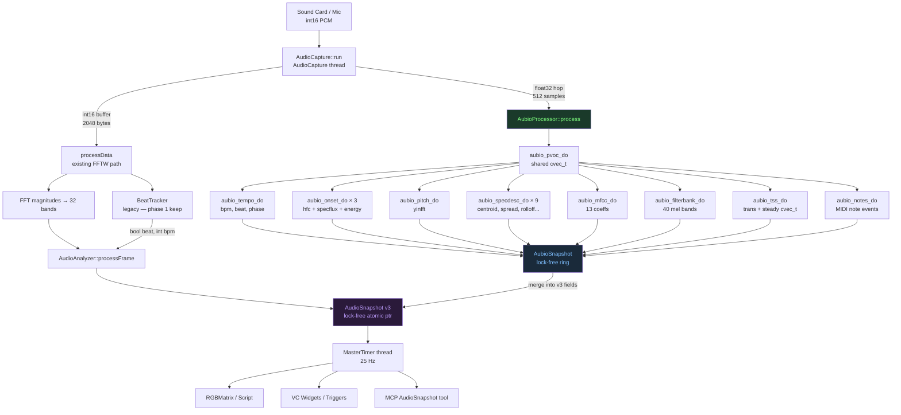

# aubio Maximum Integration Design — QLC+ Fork

**Date:** 2025  
**Scope:** Full aubio integration for the `abossard/qlcplus` fork (GPL-3.0 accepted)  
**Prerequisite reading:** `docs/aubio-integration-research.md`

---

## 1. License Verification

- **Exact license:** GPL-3.0-or-later (SPDX: `GPL-3.0-or-later`)
- **Source:** [`COPYING`](https://github.com/aubio/aubio/blob/master/COPYING) — full GPL-3.0 text; git history shows transition from GPLv2 ~17 years ago (aubio predates the v0.4.0 marketing of "LGPL" which is a common misconception — no LGPL period has been found in commit history)
- **Commercial dual-license:** Available by contacting author (Paul Brossier) but not public/open-ended
- **Fork implications:** Combining aubio (GPL-3.0-or-later) with the existing Apache-2.0 codebase produces a combined work that must be distributed under GPL-3.0-or-later. The Apache-2.0 patent-termination clause (§3) is an "additional restriction" forbidden by GPL-3.0 §7, making the licenses one-way compatible only. This fork's `abossard/qlcplus` therefore becomes GPL-3.0-or-later as a whole for distribution purposes. The upstream `mcallegari/qlcplus` and any PRs back to it remain Apache-2.0 and cannot include aubio code.

---

## 2. Complete aubio Real-Time Feature Catalog

All objects share the lifecycle pattern:
```c
T *obj = new_aubio_T(...);   // allocate + init
aubio_T_do(obj, in, out);   // process one hop (real-time safe)
del_aubio_T(obj);            // free
```
Input is always `fvec_t *` (float32 PCM, `hop_size` samples). Output varies per object.

### 2.1 `aubio_pvoc_t` — Phase Vocoder (Foundation Layer)

- **Purpose:** Converts hop-sized PCM → `cvec_t` (norm + phase, `win_s/2+1` bins). The **shared spectral frame** fed to all spectral descriptors, MFCC, TSS.
- **Signatures:**
  ```c
  aubio_pvoc_t *new_aubio_pvoc(uint_t win_s, uint_t hop_s);
  void aubio_pvoc_do(aubio_pvoc_t *pv, const fvec_t *in, cvec_t *fftgrain);
  void aubio_pvoc_rdo(aubio_pvoc_t *pv, cvec_t *fftgrain, fvec_t *out);  // synthesis
  void del_aubio_pvoc(aubio_pvoc_t *pv);
  ```
- **Input:** `fvec_t[hop_s]` raw PCM float32
- **Output:** `cvec_t[win_s/2+1]` (norm[] + phase[])
- **Window:** HanningZ (built-in), configurable via `aubio_pvoc_set_window()`
- **Typical sizes:** `win_s=1024, hop_s=512` @ 44100 Hz → 11.6 ms per hop
- **CPU cost:** **Medium** — one FFT per hop; this is the foundation, paid once
- **Note:** `aubio_pvoc_rdo()` enables granular/freeze visual effects (see §3)

### 2.2 `aubio_onset_t` — Onset Detection

- **Signatures:**
  ```c
  aubio_onset_t *new_aubio_onset(const char_t *method, uint_t buf_size,
                                  uint_t hop_size, uint_t samplerate);
  void aubio_onset_do(aubio_onset_t *o, const fvec_t *input, fvec_t *onset);
  uint_t aubio_onset_get_last(const aubio_onset_t *o);       // in samples
  smpl_t aubio_onset_get_last_s(const aubio_onset_t *o);     // in seconds
  smpl_t aubio_onset_get_threshold(const aubio_onset_t *o);
  uint_t aubio_onset_set_threshold(aubio_onset_t *o, smpl_t thr);
  smpl_t aubio_onset_get_minioi_s(const aubio_onset_t *o);
  void del_aubio_onset(aubio_onset_t *o);
  ```
- **Input:** `fvec_t[hop_s]` PCM
- **Output:** `fvec_t[1]` — non-zero when onset detected; value = detection function output
- **Algorithm variants** (`method` string):

  | Method | Description | Best for | CPU |
  |--------|-------------|----------|-----|
  | `"energy"` | Local frame energy rise | Loud transients | Cheap |
  | `"hfc"` | High Frequency Content | Percussive (kick, snare) | Cheap |
  | `"complex"` | Complex domain phase+mag | General purpose | Medium |
  | `"phase"` | Phase deviation only | Tonal attacks | Medium |
  | `"wphase"` | Weighted phase deviation | Tonal, soft attacks | Medium |
  | `"specdiff"` | Spectral difference | Broadband changes | Medium |
  | `"kl"` | Kullback-Leibler | Noise-robust | Medium |
  | `"mkl"` | Modified K-L | Noise-robust, smoother | Medium |
  | `"specflux"` | Spectral flux (L1 positive) | Most genres | Medium |
  | `"default"` | Alias for `"hfc"` | — | Cheap |

- **Typical sizes:** `buf_size=1024, hop_size=512`
- **CPU cost:** Cheap–Medium per method; multiple instances multiplied

### 2.3 `aubio_tempo_t` — Beat Tracking / BPM

- **Signatures:**
  ```c
  aubio_tempo_t *new_aubio_tempo(const char_t *method, uint_t buf_size,
                                  uint_t hop_size, uint_t samplerate);
  void aubio_tempo_do(aubio_tempo_t *o, const fvec_t *input, fvec_t *tempo);
  smpl_t aubio_tempo_get_bpm(aubio_tempo_t *o);
  smpl_t aubio_tempo_get_confidence(aubio_tempo_t *o);
  smpl_t aubio_tempo_get_period_s(aubio_tempo_t *o);   // seconds per beat
  smpl_t aubio_tempo_get_last_s(aubio_tempo_t *o);     // last beat timestamp
  uint_t aubio_tempo_was_tatum(aubio_tempo_t *o);      // 2=beat, 1=tatum, 0=none
  smpl_t aubio_tempo_get_last_tatum(aubio_tempo_t *o);
  uint_t aubio_tempo_set_tatum_signature(aubio_tempo_t *o, uint_t sig);
  void del_aubio_tempo(aubio_tempo_t *o);
  ```
- **Input:** `fvec_t[hop_s]` PCM
- **Output:** `fvec_t[2]` — `[0]` non-zero on beat, `[1]` non-zero on tatum
- **Algorithm:** Dixon comb-filter beat induction on the onset novelty function; `method="default"` is the only documented option
- **Beat phase:** derivable as `(currentSamplePosition - lastBeatSample) / periodSamples`, range [0,1)
- **Tatum:** sub-beat subdivision (e.g., 8th notes); `set_tatum_signature(4)` = 4 tatums/beat
- **CPU cost:** **Medium** — contains its own pvoc + comb filter

### 2.4 `aubio_pitch_t` — Pitch (F0) Detection

- **Signatures:**
  ```c
  aubio_pitch_t *new_aubio_pitch(const char_t *method, uint_t buf_size,
                                  uint_t hop_size, uint_t samplerate);
  void aubio_pitch_do(aubio_pitch_t *o, const fvec_t *in, fvec_t *out);
  smpl_t aubio_pitch_get_confidence(aubio_pitch_t *o);
  uint_t aubio_pitch_set_unit(aubio_pitch_t *o, const char_t *mode);  // "Hz","midi","cent","bin"
  uint_t aubio_pitch_set_silence(aubio_pitch_t *o, smpl_t silence_dB);
  uint_t aubio_pitch_set_tolerance(aubio_pitch_t *o, smpl_t tol);
  void del_aubio_pitch(aubio_pitch_t *o);
  ```
- **Input:** `fvec_t[hop_s]` PCM
- **Output:** `fvec_t[1]` — pitch value in selected unit
- **Algorithm variants:**

  | Method | Description | CPU | Best for |
  |--------|-------------|-----|----------|
  | `"yin"` | YIN autocorrelation (de Cheveigné 2002) | Medium | Monophonic instruments |
  | `"yinfast"` | YIN computed in spectral domain | Medium | Same, slightly faster |
  | `"yinfft"` | Tapered square diff via FFT | Medium | Best accuracy |
  | `"fcomb"` | Fast harmonic comb filter | Cheap | Harmonic sounds |
  | `"mcomb"` | Multi-comb + spectral flattening | Medium | Polyphonic hint |
  | `"schmitt"` | Schmitt trigger zero-crossing | Very cheap | Simple tones |
  | `"default"` | Alias for `"yinfft"` | Medium | — |

- **Output units:** Hz, MIDI note (0–127), cents, bin index
- **CPU cost:** **Medium** — `"schmitt"` cheapest; `"yinfft"` most accurate

### 2.5 `aubio_notes_t` — Note Transcription

- **Signatures:**
  ```c
  aubio_notes_t *new_aubio_notes(const char_t *method, uint_t buf_size,
                                  uint_t hop_size, uint_t samplerate);
  void aubio_notes_do(aubio_notes_t *o, const fvec_t *input, fvec_t *output);
  uint_t aubio_notes_set_silence(aubio_notes_t *o, smpl_t silence_dB);
  uint_t aubio_notes_set_minioi_ms(aubio_notes_t *o, smpl_t minioi_ms);
  uint_t aubio_notes_set_release_drop(aubio_notes_t *o, smpl_t release_drop_dB);
  void del_aubio_notes(aubio_notes_t *o);
  ```
- **Input:** `fvec_t[hop_s]` PCM
- **Output:** `fvec_t[3]` — `[0]` MIDI note value (0=none), `[1]` velocity, `[2]` MIDI note-off value
- **Internals:** Combines onset + pitch internally; monophonic only
- **CPU cost:** **Medium-High** — double analysis internally

### 2.6 `aubio_specdesc_t` — Spectral Descriptors

- **Signatures:**
  ```c
  aubio_specdesc_t *new_aubio_specdesc(const char_t *method, uint_t buf_size);
  void aubio_specdesc_do(aubio_specdesc_t *o, const cvec_t *fftgrain, fvec_t *desc);
  void del_aubio_specdesc(aubio_specdesc_t *o);
  ```
- **Input:** `cvec_t[win_s/2+1]` — spectral frame from `aubio_pvoc_do()`
- **Output:** `fvec_t[1]` — single scalar per frame
- **All descriptor methods** (one `aubio_specdesc_t` per method, or instantiate multiple):

  | Method | Description | Lighting use | CPU |
  |--------|-------------|-------------|-----|
  | `"energy"` | Total frame energy | Volume bar | Cheap |
  | `"hfc"` | High Frequency Content | Cymbal detector | Cheap |
  | `"complex"` | Complex domain novelty | General onset | Medium |
  | `"phase"` | Phase deviation | Tonal changes | Medium |
  | `"wphase"` | Weighted phase deviation | Soft tonal | Medium |
  | `"specdiff"` | Spectral difference | Broadband | Medium |
  | `"kl"` | Kullback-Leibler | Noise-robust | Medium |
  | `"mkl"` | Modified K-L | Smoother | Medium |
  | `"specflux"` | Spectral flux | Most genres | Medium |
  | `"centroid"` | Spectral centroid (bin) | Warm/cool axis | **Cheap** |
  | `"spread"` | Spectral spread (variance) | Saturation | **Cheap** |
  | `"skewness"` | 3rd moment — asymmetry | Low/high lean | Cheap |
  | `"kurtosis"` | 4th moment — peakedness | Flatness | Cheap |
  | `"slope"` | Linear spectral slope | Brightness trend | Cheap |
  | `"decrease"` | Perceptual decrease rate | Spectral tilt | Cheap |
  | `"rolloff"` | 95% energy cutoff bin | Master dimmer | Cheap |

- **Note:** `centroid`, `rolloff` etc. output **bin index** — use `aubio_bintofreq(bin, samplerate, fft_size)` to convert to Hz
- **Key advantage:** All share the `cvec_t` from a **single** `aubio_pvoc_do()` call — no extra FFTs

### 2.7 `aubio_mfcc_t` — Mel-Frequency Cepstral Coefficients

- **Signatures:**
  ```c
  aubio_mfcc_t *new_aubio_mfcc(uint_t buf_size, uint_t n_filters,
                                uint_t n_coeffs, uint_t samplerate);
  void aubio_mfcc_do(aubio_mfcc_t *mf, const cvec_t *in, fvec_t *out);
  uint_t aubio_mfcc_set_mel_coeffs(aubio_mfcc_t *mf, smpl_t fmin, smpl_t fmax);
  uint_t aubio_mfcc_set_mel_coeffs_htk(aubio_mfcc_t *mf, smpl_t fmin, smpl_t fmax);
  uint_t aubio_mfcc_set_mel_coeffs_slaney(aubio_mfcc_t *mf);  // 40 filters, default
  uint_t aubio_mfcc_set_power(aubio_mfcc_t *mf, smpl_t power);
  uint_t aubio_mfcc_set_scale(aubio_mfcc_t *mf, smpl_t scale);
  void del_aubio_mfcc(aubio_mfcc_t *mf);
  ```
- **Input:** `cvec_t[win_s/2+1]` from pvoc
- **Output:** `fvec_t[n_coeffs]` — typically 13 coefficients (c0=energy, c1–12=timbre)
- **Recommended config:** `n_filters=40, n_coeffs=13` for instrument detection
- **Mel variants:** Slaney (perceptual default), HTK (speech standard), custom via `set_mel_coeffs(fmin, fmax)`
- **CPU cost:** **Medium** — filterbank matrix multiply + DCT; share pvoc frame

### 2.8 `aubio_filterbank_t` — General Spectral Filterbank

- **Signatures:**
  ```c
  aubio_filterbank_t *new_aubio_filterbank(uint_t n_filters, uint_t win_s);
  void aubio_filterbank_do(aubio_filterbank_t *f, const cvec_t *in, fvec_t *out);
  fmat_t *aubio_filterbank_get_coeffs(const aubio_filterbank_t *f);
  uint_t aubio_filterbank_set_coeffs(aubio_filterbank_t *f, const fmat_t *filters);
  uint_t aubio_filterbank_set_mel_coeffs(aubio_filterbank_t *f, uint_t sr, smpl_t fmin, smpl_t fmax);
  uint_t aubio_filterbank_set_mel_coeffs_htk(aubio_filterbank_t *f, uint_t sr, smpl_t fmin, smpl_t fmax);
  uint_t aubio_filterbank_set_mel_coeffs_slaney(aubio_filterbank_t *f, uint_t sr);
  uint_t aubio_filterbank_set_triangle_bands(aubio_filterbank_t *f, const fvec_t *freqs, uint_t sr);
  uint_t aubio_filterbank_set_norm(aubio_filterbank_t *f, smpl_t norm);
  uint_t aubio_filterbank_set_power(aubio_filterbank_t *f, smpl_t power);
  void del_aubio_filterbank(aubio_filterbank_t *f);
  ```
- **Input:** `cvec_t` from pvoc
- **Output:** `fvec_t[n_filters]` — energy per band
- **Variants:** Mel (Slaney/HTK), custom triangle bands via frequency vector
- **Use case:** 40-band mel = perceptual VU bar; custom bands = per-instrument zone
- **CPU cost:** **Cheap-Medium** — matrix multiply, but matrix is sparse

### 2.9 `aubio_tss_t` — Transient / Steady-State Separation

- **Signatures:**
  ```c
  aubio_tss_t *new_aubio_tss(uint_t buf_size, uint_t hop_size);
  void aubio_tss_do(aubio_tss_t *o, const cvec_t *input,
                    cvec_t *trans, cvec_t *stead);
  uint_t aubio_tss_set_threshold(aubio_tss_t *o, smpl_t thrs);
  uint_t aubio_tss_set_alpha(aubio_tss_t *o, smpl_t alpha);  // default 3
  uint_t aubio_tss_set_beta(aubio_tss_t *o, smpl_t beta);    // default 3
  void del_aubio_tss(aubio_tss_t *o);
  ```
- **Input:** `cvec_t` from pvoc
- **Output:** Two `cvec_t` — transient component + steady-state component
- **Algorithm:** Duxbury 2001 multiresolution analysis; alpha/beta control sensitivity
- **Energy summary:** `transientEnergy = sum(trans->norm)`, `steadyEnergy = sum(stead->norm)`
- **CPU cost:** **Medium** — complex spectral operations on both components

### 2.10 Synthesis Objects (Skip for Analysis Pipeline)

- **`aubio_wavetable_t`** — wavetable oscillator, synthesis only, not relevant
- **`aubio_sampler_t`** — sample playback, synthesis only, not relevant
- **`aubio_pvoc_t::rdo()`** — inverse pvoc; useful only for granular visual feedback trick (see §3.6)

---

## 3. Lighting Effect Mapping

### 3.1 `aubio_pitch_t` → Color

- **Hue from pitch:** Map MIDI note (0–127) to hue 0°–360° via `hue = (midiNote % 12) * 30.0`. Middle C (60) = cyan, A4 (69) = yellow-green. Confidence gates the saturation: low confidence → desaturate.
- **Chromatic wheel:** 12-semitone color wheel mapped to fixture RGB. Each note class → fixed hue; octave → brightness multiplier (higher octave = brighter).
- **Pitch glide effect:** Interpolate fixture hue toward target when note changes. Smooth `pitchHz` with a 1-pole IIR for slow color drifts on sustained tones.

  ```js
  // RGBScript sketch
  var hue = (audio.pitch.midi % 12) * 30;
  var sat = audio.pitch.confidence;
  return hsvToRgb(hue, sat, audio.volume.normalized);
  ```

### 3.2 `aubio_onset_t` × Method → Flash Type

- **Percussive flash (hfc):** Sharp intensity burst, 1-frame duration, full white. Ideal for snare/kick.
- **Tonal swell (complex/phase):** 4-frame fade-in then 8-frame fade-out on a colored wash. Maps to sustained chord changes.
- **Spectral shimmer (specflux):** Random pixel scatter at onset — set `N` random pixels to max brightness for 2 frames, fade exponentially. "Glitter on note changes."
- **Multi-method voting:** Run 3 cheap methods (hfc, energy, specflux) in parallel; if 2+ fire on same frame → "strong onset" → full-rig white flash; 1 fires → "soft onset" → color shift only. Bitmask stored as `onsetMethodVotes`.

### 3.3 `aubio_mfcc_t` → Timbre Palette

- **Instrument fingerprint:** Compute distance between current MFCC vector and pre-recorded centroids for kick (sub-heavy, c0↑), snare (c1–c3 spike), hihat (c4–c8 spread). Nearest centroid → select palette.
- **Color palettes:**
  - Kick: Deep reds/oranges (`hue ∈ [0°, 30°]`)
  - Snare: Cold white/blue (`hue ∈ [200°, 220°]`)
  - Hi-hat: Cyan/teal shimmer (`hue ∈ [170°, 190°]`)
  - Sustained string: Soft purple (`hue ∈ [270°, 290°]`)
- **Timbre morph:** Blend between two palette colors using `cos²(dist_normalized * π/2)` weight for smooth transitions as timbre changes.

### 3.4 `aubio_specdesc_t` → Global Lighting Parameters

| Descriptor | Range | Lighting parameter |
|------------|-------|--------------------|
| `centroid` (Hz) | 200–8000 | Warm/cool color temperature axis: low=amber, high=blue-white |
| `spread` | 0–1 (normalized) | Saturation: narrow spectrum=monochrome, wide=full rainbow |
| `skewness` | negative↔positive | Shift hue: negative (bass-heavy) → red shift; positive → blue shift |
| `kurtosis` | low↔high | Strobe rate: peaky spectrum → faster flicker |
| `rolloff` (Hz) | 1000–16000 | Master dimmer ceiling: `dim_max = rolloff / 16000` |
| `slope` | negative | Brightness of high fixtures vs low fixtures — slope drives vertical rig split |
| `decrease` | — | Governs fade speed: faster spectral decrease → faster dimout |
| `specflux` | 0–1 | Overall "energy in motion" → pan/tilt speed on moving heads |

### 3.5 `aubio_filterbank_t` (Mel Bands) → Bar Graph / Zonal VU

- **40-band mel VU:** Each mel band → one DMX channel or one row of a matrix fixture. Bass bands (low mel) → deep red; mid bands → green; high mel → blue-white. Level = brightness.
- **Row-by-row matrix activation:** For a 10×4 LED matrix, group 40 mel bands into 4 rows of 10 bins. Brightness of each cell = mel band energy. Classic "spectrum analyzer on rig" effect.
- **Custom instrument bands:** Set triangle bands at 80, 200, 500, 1500, 4000 Hz for a 5-zone split matching sub / bass / mid / presence / air. Map to 5 fixture groups.

### 3.6 `aubio_tss_t` → Dual-Layer Effects

- **Strobe layer on transients:** When `transientEnergy > threshold`, trigger high-rate strobe (25–50 Hz) on a dedicated strobe fixture for 2–4 frames.
- **Ambient layer on steady:** Steady-state energy drives slow color morphing on wash fixtures. No strobing — smooth hue drift at `steadyEnergy × hue_speed`.
- **Freeze effect:** Pass `stead` component through `aubio_pvoc_rdo()` → reconstruct audio without transients. Use energy envelope of this resynthesized signal to drive a "held note" ambient color that doesn't flash on drums.

### 3.7 `aubio_notes_t` → MIDI-Like Triggers

- **Note-on:** When `output[0] > 0` (MIDI note detected), trigger a Scene or Chaser mapped to that MIDI note number. `output[1]` (velocity) scales brightness.
- **Note-off:** `output[2] > 0` → release/fade that fixture group.
- **Chord color map:** Track last 3 simultaneous notes; compute average MIDI pitch → select a chord palette (major chord → warm, minor chord → cool, diminished → purple).

### 3.8 `aubio_tempo_t` → BPM-Locked Effects

- **Strobe sync:** Fire strobe exactly on `aubio_tempo_do()` beat output; use `get_period_s()` to pre-arm a timer for next beat prediction.
- **Beat phase chase:** `beatPhase ∈ [0,1)` drives a sawtooth intensity function across a chase of N fixtures: `fixture[i].brightness = clamp(beatPhase - i/N, 0, 1)`.
- **Tatum subdivision:** Set `tatum_signature=4` → get 16th-note grid ticks. Drive a 4×4 matrix with each tatum lighting one cell in sequence.

---

## 4. Expanded `AudioSnapshot` Design

### 4.1 C++ Header Sketch

```cpp
// audiosnapshot.h — version 3
#pragma once
#include <cstdint>
#include <array>
#include <vector>

static constexpr int AUDIO_SNAPSHOT_VERSION = 3;
static constexpr int MFCC_COEFFS = 13;
static constexpr int MEL_BANDS   = 40;

struct PerceptualBands { /* ... unchanged ... */ };
struct TriggerState    { /* ... unchanged ... */ };

struct OnsetVotes {
    bool    hfc      = false;
    bool    energy   = false;
    bool    complex_ = false;  // 'complex' is reserved
    bool    specflux = false;
    bool    phase    = false;
    uint8_t count    = 0;      // number of methods that fired
};

struct NoteEvent {
    uint8_t midiNote = 0;
    uint8_t velocity = 0;
    bool    noteOn   = false;
    bool    noteOff  = false;
};

struct AudioSnapshot {
    int version = AUDIO_SNAPSHOT_VERSION;

    // ── Unchanged v1/v2 fields ─────────────────────────────────────
    PerceptualBands bands;
    double spectrum[32] = {};
    TriggerState triggers[5];
    TriggerState volumeTrigger;
    TriggerState beatTrigger;

    struct {
        double raw = 0.0, smoothed = 0.0, normalized = 0.0, agc = 0.0;
    } volume;

    struct {
        bool   beat           = false;
        double bpm            = 0.0;      // was int in v1, now double
        double beatPhase      = 0.0;      // 0..1 within beat period
        double beatConfidence = 0.0;
        bool   tatum          = false;    // NEW: sub-beat
        double tatumsPerBeat  = 4.0;      // NEW
    } music;

    struct {
        double rmsDb = -96.0, peakDb = -96.0, crestFactor = 1.0;
        double centroidHz = 0.0;
        double rolloffHz  = 0.0;
        double flatness   = 1.0;
        double flux       = 0.0;
    } features;

    double audioDtMs     = 0.0;
    double brightnessFloor = 0.0;
    bool   noiseGateClosed = false;

    // ── NEW v3 fields ──────────────────────────────────────────────

    // Onset
    struct {
        bool       fired      = false;
        double     confidence = 0.0;
        OnsetVotes votes;
    } onset;

    // Pitch
    struct {
        double pitchHz    = 0.0;
        double pitchMidi  = 0.0;    // float MIDI note (includes cents)
        double confidence = 0.0;
        bool   active     = false;  // above silence threshold
    } pitch;

    // Spectral descriptors (all from shared pvoc frame)
    struct {
        double centroidHz  = 0.0;
        double spread      = 0.0;
        double skewness    = 0.0;
        double kurtosis    = 0.0;
        double slope       = 0.0;
        double decrease    = 0.0;
        double rolloffHz   = 0.0;
        double hfc         = 0.0;
        double specflux    = 0.0;
    } spectral;

    // MFCC
    std::array<float, MFCC_COEFFS> mfcc = {};

    // Mel filterbank
    std::array<float, MEL_BANDS> melBands = {};

    // Transient / Steady-State
    struct {
        double transientEnergy = 0.0;
        double steadyEnergy    = 0.0;
        double transientRatio  = 0.0;  // transient / (transient + steady)
    } tss;

    // Notes (monophonic; NoteEvent is valid only if midiNote > 0)
    NoteEvent note;
};
```

### 4.2 Memory Size Analysis

| Field group | Size |
|-------------|------|
| v1/v2 base fields | ~400 bytes |
| onset + pitch structs | ~48 bytes |
| spectral descriptors | ~72 bytes |
| mfcc array (13 × float32) | 52 bytes |
| melBands (40 × float32) | 160 bytes |
| tss struct | 24 bytes |
| note event | 4 bytes |
| **Total v3** | **~760 bytes** |

- Published at 44100/512 ≈ 86 frames/sec via lock-free ring (3 slots)
- Ring buffer: 3 × 760 bytes = **~2.3 KB** — negligible

### 4.3 Versioning Strategy

- **`version` field** lets RGBScript and VC widgets detect capabilities at runtime
- **Backward compat:** v1/v2 fields remain at same offsets; new fields are zero-initialized (safe default behavior for old scripts)
- **QML property binding:** Expose version via `Q_PROPERTY(int audioSnapshotVersion ...)` on the AudioAnalyzer QML object

---

## 5. RGB Script API v3

### 5.1 Exposed `audio` Object

```js
// audio object exposed to RGBScript (version 3)
audio = {
  version: 3,

  // v1/v2 (unchanged)
  bands: { sub: 0.4, bass: 0.7, lowMid: 0.3, mid: 0.5, high: 0.2, low: 0.6 },
  spectrum: [/* 32 floats */],
  volume:   { raw: 0.6, smoothed: 0.58, normalized: 0.72, agc: 0.65 },
  features: { rmsDb: -18.0, centroidHz: 1200, rolloffHz: 4500, flatness: 0.3, flux: 0.12 },
  noiseGateClosed: false,

  // v3 new fields
  bpm:       128.5,
  beatPhase: 0.42,           // 0..1
  beat:      true,
  tatum:     false,

  onset: {
    fired:      true,
    confidence: 0.87,
    votes: { hfc: true, energy: true, specflux: false, phase: false, count: 2 }
  },

  pitch: {
    hz:         440.0,
    midi:       69.0,          // float, includes cents
    confidence: 0.91,
    active:     true
  },

  spectral: {
    centroidHz: 2400,
    spread:     800,
    skewness:  -0.3,
    kurtosis:   2.1,
    slope:     -0.0004,
    decrease:   0.002,
    rolloffHz:  6000,
    hfc:        0.45,
    specflux:   0.23
  },

  mfcc: [/* 13 floats: c0..c12 */],
  mel:  [/* 40 floats: band 0..39 */],

  tss: {
    transientEnergy: 0.6,
    steadyEnergy:    0.4,
    transientRatio:  0.6
  },

  note: { midi: 69, velocity: 100, noteOn: true, noteOff: false }
};
```

### 5.2 Example Script 1 — Pitch-to-Hue

```js
// pitch-hue.js — Map dominant pitch to hue, confidence to saturation
function rgbMap(step, numLeds, rgb) {
  if (audio.version < 3 || !audio.pitch.active) {
    rgb.r = rgb.g = rgb.b = Math.floor(audio.volume.normalized * 128);
    return;
  }
  var hue = (audio.pitch.midi % 12) * 30.0;        // 0..360
  var sat = Math.min(1.0, audio.pitch.confidence);
  var val = Math.min(1.0, audio.volume.normalized * 1.5);
  var c = hsvToRgb(hue, sat, val);                  // hsvToRgb is a built-in helper
  rgb.r = Math.floor(c.r * (step / numLeds));        // slight stagger per LED
  rgb.g = c.g;
  rgb.b = c.b;
}
```

### 5.3 Example Script 2 — Onset Flash with Method Selectivity

```js
// onset-flash.js — Multi-method onset voting drives flash intensity
var flashDecay = 0;
function rgbMap(step, numLeds, rgb) {
  if (audio.version >= 3 && audio.onset.fired) {
    // Strong onset (2+ methods) = full white flash
    // Weak onset (1 method) = color pulse
    flashDecay = (audio.onset.votes.count >= 2) ? 1.0 : 0.4;
  }
  if (flashDecay > 0.01) {
    rgb.r = rgb.g = rgb.b = Math.floor(255 * flashDecay);
    flashDecay *= 0.75;  // exponential decay across frames (~25 Hz)
  } else {
    rgb.r = Math.floor(audio.tss.steadyEnergy * 120);
    rgb.g = Math.floor(audio.spectral.centroidHz / 8000 * 255);
    rgb.b = Math.floor((1 - audio.tss.transientRatio) * 180);
  }
}
```

### 5.4 Example Script 3 — MFCC Timbre Palette

```js
// mfcc-timbre.js — Select palette based on MFCC distance to instrument centroids
var kickCentroid  = [80, 10, -5, 2, 0, 0, 0, 0, 0, 0, 0, 0, 0];
var snareCentroid = [60, 30, 20, -3, 5, 2, 0, 0, 0, 0, 0, 0, 0];
var hihatCentroid = [40, 15, 10, 8, 10, 12, 8, 4, 2, 0, 0, 0, 0];

function mfccDist(a, b) {
  var d = 0;
  for (var i = 1; i < 13; i++) d += (a[i]-b[i])*(a[i]-b[i]);
  return Math.sqrt(d);
}

function rgbMap(step, numLeds, rgb) {
  if (audio.version < 3) { rgb.r = rgb.g = rgb.b = 100; return; }
  var m = audio.mfcc;
  var dk = mfccDist(m, kickCentroid);
  var ds = mfccDist(m, snareCentroid);
  var dh = mfccDist(m, hihatCentroid);
  var v  = Math.floor(audio.volume.normalized * 220);
  if (dk < ds && dk < dh) {       // kick-like → red
    rgb.r = v; rgb.g = Math.floor(v*0.2); rgb.b = 0;
  } else if (ds < dh) {           // snare-like → cold white
    rgb.r = Math.floor(v*0.7); rgb.g = Math.floor(v*0.8); rgb.b = v;
  } else {                        // hihat-like → teal
    rgb.r = 0; rgb.g = Math.floor(v*0.8); rgb.b = v;
  }
}
```

### 5.5 Virtual Console Widget Bindings

- **Slider input — Pitch (Hz):** Bind `audio.pitch.hz` (20–2000 Hz range) to a VC slider controlling fixture hue via a Scene function.
- **Slider input — Onset confidence:** Bind `audio.onset.confidence` (0..1) to a VC slider controlling strobe rate on a dedicated fixture group.
- **Button auto-trigger — Beat:** `audio.beat` fires the beatTrigger, which can release a Chaser step on each beat.
- **Display widget — BPM:** Show `audio.bpm` as read-only numeric in the VC.
- **Implementation note:** The existing `AudioChannel::buildSnapshot()` feeds `AudioSnapshot` into `AudioAnalyzer`; a new `AubioChannel` parallel to `AudioChannel` can expose the v3 fields to the same VC binding infrastructure.

---

## 6. Integration Architecture

### 6.1 Full Pipeline Diagram



### 6.2 Phase Strategy

**Phase 1 — Parallel operation (keep FFTW):**
- `AubioProcessor` runs alongside existing `BeatTracker` and `AudioAnalyzer`
- `AudioSnapshot v3` merges: v1/v2 fields from existing path + v3 fields from aubio
- No removal of old code; regression risk zero
- Validation: compare `music.bpm` (old) with `bpm` (aubio) on test signals

**Phase 2 — aubio replaces FFTW subsystems:**
- Remove `BeatTracker` (replaced by `aubio_tempo_t`)
- Replace `computeSpectralCentroid/Rolloff/Flatness/Flux` in `AudioAnalyzer` with `aubio_specdesc_t` reads from shared pvoc
- Keep FFTW only for the 32-band legacy display (`fillBandsData`) — or replace with mel filterbank
- Phase 2 is optional; only proceed if Phase 1 is stable

### 6.3 Threading Model

```
AudioCapture thread (this->run())
  ├─ readAudio()                   // blocking PCM read
  ├─ processData()                 // FFTW path (keep in phase 1)
  │    └─ BeatTracker::processAudio()
  ├─ AubioProcessor::process()     // NEW — called after processData()
  │    ├─ convert int16→float (fast loop, no malloc)
  │    ├─ aubio_pvoc_do()          // one FFT
  │    ├─ aubio_tempo_do()
  │    ├─ aubio_onset_do() × 3
  │    ├─ aubio_pitch_do()
  │    ├─ aubio_specdesc_do() × N
  │    ├─ aubio_mfcc_do()
  │    ├─ aubio_filterbank_do()
  │    ├─ aubio_tss_do()
  │    └─ aubio_notes_do()
  └─ AudioAnalyzer::processFrame() // merge results into AudioSnapshot v3
       └─ publishSnapshot()        // std::atomic<AudioSnapshot*> swap
```

- **Thread safety:** All `aubio_*_t` objects created and called **exclusively** on the AudioCapture thread. Safe per aubio's threading contract.
- **Main thread reads:** `AudioSnapshot` published via `std::atomic<const AudioSnapshot*>` with `std::memory_order_acquire/release` — no mutex needed on the read path (MasterTimer / QML / MCP).

### 6.4 Hop / Buffer Sizing

| Parameter | Current QLC+ | aubio default | Recommended |
|-----------|-------------|---------------|-------------|
| Sample rate | 44100 | 44100 | 44100 |
| Buffer (bytes) | 2048 | — | 2048 (keep) |
| Samples/block | 1024 int16 | 512 float | 512 (sub-hop) |
| Latency | ~23.2 ms | ~11.6 ms | ~11.6 ms |
| FFT window | — | 1024 | 1024 |

- **Solution:** Split each 1024-sample QLC+ block into **two 512-sample hops** before passing to aubio. The conversion loop `int16 → float32 / 32768.0` already needed; split it at index 512.
- **Alternative:** Set aubio `hop_s=1024` for exact block match at cost of doubled latency (23 ms). Acceptable for visual effects; imperceptible to audience.
- **Recommendation:** Use `hop_s=512` (two sub-hops per QLC+ block). Output the second hop's snapshot as the frame's canonical snapshot.

### 6.5 `AubioProcessor` Class Sketch

```cpp
// aubio_processor.h
#pragma once
#include <aubio/aubio.h>
#include "audiosnapshot.h"

class AubioProcessor {
public:
    struct Config {
        bool enableTempo    = true;
        bool enableOnset    = true;   // hfc + specflux + energy
        bool enablePitch    = true;   // yinfft
        bool enableSpecdesc = true;   // all 9 descriptors
        bool enableMfcc     = true;
        bool enableMel      = true;
        bool enableTss      = false;  // medium CPU, opt-in
        bool enableNotes    = false;  // higher CPU, opt-in
    };

    explicit AubioProcessor(uint_t sampleRate, uint_t hopSize,
                             uint_t winSize, Config cfg = {});
    ~AubioProcessor();

    // Call from AudioCapture thread, once per hop_s PCM samples.
    // Input: float32[-1..1], hopSize elements.
    void process(const float *pcm, AudioSnapshot &snap);

private:
    void initObjects();
    void freeObjects();

    uint_t m_sr, m_hop, m_win;
    Config m_cfg;

    // Shared spectral frame
    aubio_pvoc_t   *m_pvoc   = nullptr;
    fvec_t         *m_in     = nullptr;
    cvec_t         *m_grain  = nullptr;

    // Per-feature objects
    aubio_tempo_t  *m_tempo  = nullptr;
    fvec_t         *m_tempoOut = nullptr;

    aubio_onset_t  *m_onsetHfc     = nullptr;
    aubio_onset_t  *m_onsetFlux    = nullptr;
    aubio_onset_t  *m_onsetEnergy  = nullptr;
    fvec_t         *m_onsetOut     = nullptr;

    aubio_pitch_t  *m_pitch    = nullptr;
    fvec_t         *m_pitchOut = nullptr;

    // 9 specdesc instances
    aubio_specdesc_t *m_desc[9]  = {};
    fvec_t           *m_descOut  = nullptr;  // reused, size 1

    aubio_mfcc_t     *m_mfcc     = nullptr;
    fvec_t           *m_mfccOut  = nullptr;  // size MFCC_COEFFS

    aubio_filterbank_t *m_mel    = nullptr;
    fvec_t             *m_melOut = nullptr;  // size MEL_BANDS

    aubio_tss_t  *m_tss        = nullptr;
    cvec_t       *m_transCvec  = nullptr;
    cvec_t       *m_steadCvec  = nullptr;

    aubio_notes_t *m_notes     = nullptr;
    fvec_t        *m_notesOut  = nullptr;   // size 3
};
```

### 6.6 Phase-Out Plan

| Component | Phase out in | Replacement |
|-----------|-------------|-------------|
| `BeatTracker` | Phase 2 | `aubio_tempo_t` |
| `AudioAnalyzer::computeSpectralCentroid()` | Phase 2 | `aubio_specdesc_t("centroid")` |
| `AudioAnalyzer::computeSpectralRolloff()` | Phase 2 | `aubio_specdesc_t("rolloff")` |
| `AudioAnalyzer::computeSpectralFlatness()` | Phase 2 | retained (no aubio equivalent) |
| `AudioAnalyzer::computeSpectralFlux()` | Phase 2 | `aubio_specdesc_t("specflux")` |
| `AudioAnalyzer::computeBands32()` via FFTW | Phase 3 | `aubio_filterbank_t` (mel) or keep |
| `AudioCapture` FFTW plan | Phase 3 (optional) | pvoc serves all downstreams |

### 6.7 Configuration UI

- **Settings dialog / QML panel:** Checkbox group: `[ ] Enable pitch`, `[ ] Enable MFCC / timbre`, `[ ] Enable TSS (strobe layer)`, `[ ] Enable note tracking`
- **CPU budget indicator:** Measure `AubioProcessor::process()` wall-clock time; display in `avgFrameTimeUs` alongside existing `AudioAnalyzer` timing metrics
- **Preset profiles:**
  - **Minimal (cheapest):** tempo + onset(hfc) + centroid
  - **Standard:** all except TSS/notes
  - **Maximum:** all features enabled
- Stored in QSettings under `audio/aubio/*`

---

## 7. Build Integration

### 7.1 aubio Build System

- **Native build system:** `waf` (Python 3) — `./waf configure && ./waf build`
- **No official CMakeLists.txt** in `aubio/aubio` as of v0.4.9
- **Source size:** ~50 `.c` files in `src/`, ~30 in `src/spectral/`, ~10 utility files; total ~120 files, compilable as plain C99

### 7.2 Strategy Comparison

| Strategy | Pros | Cons |
|----------|------|------|
| System package (`brew`/`apt`/`vcpkg`) | Zero build complexity | Version skew; vcpkg requires separate toolchain; not portable |
| Git submodule + waf via `ExternalProject_Add` | Reproducible version | Requires Python3+waf at configure time; slow first build |
| **Vendored source + CMake wrapper** ✅ | Self-contained; CI-friendly; no waf/Python needed | Must maintain CMakeLists for aubio src |

**Recommendation:** Vendored source (`external/aubio/`) with a custom CMake wrapper that compiles aubio's `.c` files directly. This avoids any external tool dependency (waf, pkg-config, brew) and integrates cleanly with the existing `HAS_FFTW3` detection.

### 7.3 Concrete CMake Snippet

```cmake
# external/aubio/CMakeLists.txt
cmake_minimum_required(VERSION 3.16)
project(aubio C)

set(AUBIO_SRC_DIR "${CMAKE_CURRENT_SOURCE_DIR}/src")

# Collect all aubio .c sources (excluding waf/python helpers)
file(GLOB_RECURSE AUBIO_SOURCES
    "${AUBIO_SRC_DIR}/*.c"
)
# Exclude io (sndfile/avcodec) — we don't need file I/O for real-time use
list(FILTER AUBIO_SOURCES EXCLUDE REGEX ".*/io/.*\\.c$")
list(FILTER AUBIO_SOURCES EXCLUDE REGEX ".*/synth/.*\\.c$")  # skip wavetable/sampler

add_library(aubio STATIC ${AUBIO_SOURCES})

target_include_directories(aubio
    PUBLIC  "${AUBIO_SRC_DIR}"
    PRIVATE "${AUBIO_SRC_DIR}"
)

# Match QLC+'s existing FFTW3 detection
if(HAS_FFTW3 OR FFTW3_FOUND)
    target_compile_definitions(aubio PRIVATE HAVE_FFTW3)
    target_link_libraries(aubio PRIVATE fftw3)
else()
    # aubio ships its own kissfft fallback — nothing needed
    message(STATUS "aubio: using built-in kissfft (no FFTW3)")
endif()

target_compile_options(aubio PRIVATE
    -std=c99
    -Wall
    $<$<NOT:$<CXX_COMPILER_ID:MSVC>>:-Wno-unused-parameter>
)

# Silence unused-but-set warnings in aubio internals
target_compile_options(aubio PRIVATE
    $<$<C_COMPILER_ID:GNU,Clang>:-Wno-sign-compare -Wno-float-conversion>
)
```

```cmake
# In engine/audio/CMakeLists.txt (or top-level)
if(AUBIO_INTEGRATION)
    add_subdirectory(${CMAKE_SOURCE_DIR}/external/aubio)
    target_link_libraries(qlcplusengine PRIVATE aubio)
    target_compile_definitions(qlcplusengine PRIVATE HAS_AUBIO)
endif()

option(AUBIO_INTEGRATION "Enable aubio maximum integration (GPL-3.0)" OFF)
```

### 7.4 Git Submodule Setup

```bash
# From repo root
git submodule add https://github.com/aubio/aubio.git external/aubio
git submodule update --init --recursive
# Pin to stable release
cd external/aubio && git checkout 0.4.9 && cd ../..
git add .gitmodules external/aubio
git commit -m "chore: add aubio 0.4.9 as git submodule (GPL-3.0)"
```

### 7.5 Platform Notes

| Platform | Status | Notes |
|----------|--------|-------|
| macOS (Clang) | ✅ Straightforward | `-std=c99` works; FFTW3 via `brew install fftw` |
| Linux (GCC) | ✅ Straightforward | `apt install libfftw3-dev` or vendored kissfft |
| Windows (MSVC) | ⚠️ Needs care | MSVC is not C99-compliant without `/std:c11`; rename `*.c` → `*.cpp` or add `/TC` flag; `complex.h` types need MSVC workarounds |
| Windows (MinGW/Clang-cl) | ✅ Works | Use Clang-cl with `-std=c99` |

- **Windows MSVC fix:** Add `target_compile_options(aubio PRIVATE $<$<CXX_COMPILER_ID:MSVC>:/TC /std:c11>)` and define `_USE_MATH_DEFINES` for aubio's `M_PI` usage.
- **iOS/Android:** aubio's source is portable C99; cross-compilation works with NDK/Xcode toolchains.

---

## 8. Effort Estimate

### Phase 1 — Build + AubioProcessor skeleton + tempo/onset/pitch (3–5 person-days)

- [ ] Add aubio submodule + CMake wrapper (0.5 day)
- [ ] License header update, COPYING notice, README update (0.5 day)
- [ ] `AubioProcessor` class: pvoc + tempo + onset(3 methods) + pitch (1.5 days)
- [ ] `AudioSnapshot v3` header + merge in `AudioAnalyzer` (0.5 day)
- [ ] Wire `bpm`, `beat`, `beatPhase`, `onset`, `pitch` into existing VC binding (0.5 day)
- [ ] Manual test: verify BPM accuracy vs old BeatTracker on 5 reference tracks (0.5 day)

### Phase 2 — All spectral descriptors + MFCC + mel filterbank (3–4 person-days)

- [ ] Add 9 specdesc instances sharing pvoc frame (1 day)
- [ ] `aubio_mfcc_t` integration + MFCC vector in snapshot (0.5 day)
- [ ] `aubio_filterbank_t` 40-band mel integration (0.5 day)
- [ ] `aubio_tss_t` optional integration (1 day)
- [ ] `aubio_notes_t` optional integration (0.5 day)
- [ ] CPU budget measurement + profiling pass (0.5 day)

### Phase 3 — AudioSnapshot v3 + RGBScript API v3 + 5 example scripts (3–4 person-days)

- [ ] Expose all v3 fields to RGBScript JS engine (1 day)
- [ ] Write 5 reference RGBScripts covering pitch, onset, MFCC, TSS, mel (2 days)
- [ ] Update RGBScript documentation in QML UI (0.5 day)
- [ ] QTest unit tests for snapshot merge logic (0.5 day)

### Phase 4 — VC widget bindings + configuration UI (2–3 person-days)

- [ ] Audio input channel: pitch Hz and onset confidence as bindable inputs (1 day)
- [ ] Configuration panel: QML settings dialog for aubio feature flags (1 day)
- [ ] CPU indicator widget showing `avgAubioTimeUs` (0.5 day)

### Phase 5 — Phase out legacy components (1–2 person-days)

- [ ] Remove `BeatTracker` class (0.5 day)
- [ ] Remove redundant spectral functions from `AudioAnalyzer` (0.5 day)
- [ ] Regression test suite against reference recordings (0.5 day)
- [ ] FFTW removal from AudioCapture (optional — 0.5 day; only if 32-band display replaced)

### Total Estimate

| Phase | Low | High |
|-------|-----|------|
| Phase 1 | 3 days | 5 days |
| Phase 2 | 3 days | 4 days |
| Phase 3 | 3 days | 4 days |
| Phase 4 | 2 days | 3 days |
| Phase 5 | 1 day  | 2 days |
| **Total** | **12 days** | **18 days** |

### Risk Register

| Risk | Likelihood | Impact | Mitigation |
|------|-----------|--------|-----------|
| Windows MSVC C99 compilation failures | Medium | Medium | Pre-test with Clang-cl; fallback to `/TC` |
| aubio's internal FFTW plan conflicts with QLC+'s FFTW plan | Low | Low | aubio creates independent plans; FFTW is thread-safe for plan creation |
| `hop_s=512` sub-hop split introduces phase discontinuities | Low | Low | aubio pvoc maintains its own overlap-add state; splitting is standard usage |
| MFCC instrument classification inaccurate on complex mix | Medium | Low | MFCC timbre works best on isolated tracks; document limitation; fall back to spectral centroid |
| GPL-3.0 contamination reaching upstream PRs | Medium | High | Strict branch policy: `aubio-integration` branch never PRs to `mcallegari/qlcplus`; CI check on main rejects aubio includes |
| CPU budget overflow on low-end hardware (RPi, old Intel) | Medium | Medium | `Config` flags let users disable expensive features; measure in Phase 2 and set `Standard` profile default |
| aubio 0.4.9 not maintained (last release 2019) | Low | Low | Codebase is stable C99; fork and patch if needed; API is frozen |

---

## References

- aubio source: https://github.com/aubio/aubio
- aubio license: https://github.com/aubio/aubio/blob/master/COPYING (GPL-3.0)
- aubio API reference: https://aubio.org/doc/latest/
- Onset detection: https://aubio.org/doc/latest/onset_8h.html
- Tempo: https://aubio.org/doc/latest/tempo_8h.html
- Pitch: https://aubio.org/doc/latest/pitch_8h.html
- Notes: https://aubio.org/doc/latest/notes_8h.html
- Spectral descriptors: https://aubio.org/doc/latest/specdesc_8h.html
- MFCC: https://aubio.org/doc/latest/mfcc_8h.html
- Filterbank: https://aubio.org/doc/latest/filterbank_8h.html
- Phase vocoder: https://aubio.org/doc/latest/phasevoc_8h.html
- TSS: https://aubio.org/doc/latest/tss_8h.html
- Apache + GPL compatibility: https://www.apache.org/licenses/GPL-compatibility.html
