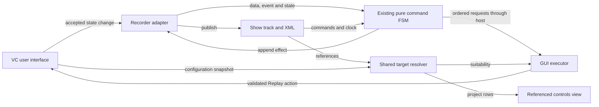

# Implementation ideas and plan

Status: planned. [Requirements](requirements.md) define behavior; [principles](core-principles.md) define ownership; [tests](test-strategy.md) define proof.

## Data and entry points

Extend the existing typed records with `SetSliderPosition` and `SetButtonState`: Show-relative milliseconds, event order, persistent control identity, expected control type/role and applicable value. For sliders, retain mode and attribute kind as compatibility fields. Keep named XML fields; choose the nesting during implementation.

Capture slider position as a fraction from `0` to `1` using the accepted integer value and capture-time range. Exclude function-intensity multiplication and raw MIDI deltas. Replay maps that fraction to the current range and rounds once; reject nonfinite values and non-increasing ranges.

Capture the resulting button state once per accepted interaction, not both a click and its derived notifications. Do not append legacy function commands for the same operation. New takes bypass the old recording-only Monitoring override so capture follows the native user action.

Add explicit state application with `Replay` provenance: `requestStateChange(bool)` currently implements a relative Toggle, so passing the recorded bool to it is insufficient. Resolve the current native state at execution and perform the needed start/stop operation. Bypass MIDI profiles, pickup and raw scaling; page selection must not redirect the saved destination.

## Flow

Retain every accepted changed slider position in capture, even if output later coalesces them. Dispatch Playing events in order and retain no-echo exclusion for live-authored events.

Route explicit local seeks through suspend, reposition, destination-state restoration and return to the prior transport state. Play from a stopped cursor uses the same restoration calculation. Mark destination events consumed so subsequent progress does not repeat them. Do not use this path for late Playing updates.

`ShowManager::requestSeek` identifies local seeks; the VDJ connector exposes positions and Play/Pause, not seek intent. Keep that distinction at the adapter. Flash remains deferred until replay-owned press/release cleanup has a defined contract.

## Work order

| Step | Files or module | Work |
|---|---|---|
| 1 | [`vcbutton`](../../qmlui/virtualconsole/vcbutton.h), existing native control effects | First red/green slice: ON promotes a monitored Scene button to Active, and the Scene survives its Collection stopping. Then cover the other state pairs and idempotence. |
| 2 | [`vcwidget`, `vcslider`, `virtualconsole`](../../qmlui/virtualconsole/), [`showcommandtrack`](../../engine/src/showcommandtrack.h) | Add accepted state capture, persistent identity, shared validation and XML round trip without engine-output sampling. |
| 3 | Existing FSM, [`Show`](../../engine/src/show.h), [`ShowRunner`](../../engine/src/showrunner.h), GUI executor | Integrate Playing progress, explicit local seek, restoration and dispatch lifetime. Preserve legacy records. |
| 4 | [`ShowCommandRecorder`](../../qmlui/showcommandrecorder.h), [`app.cpp`](../../qmlui/app.cpp), performance-view QML | Bind shared REC/target state, guard manual Show selection, and checkpoint accepted data for Save and workspace replacement. Preserve new dirty changes during saving. |
| 5 | [`ShowCommandList.qml`](../../qmlui/qml/showmanager/ShowCommandList.qml), Show editor, [`Tardis`](../../qmlui/tardis/tardis.h) | Replace the command overlay with the Recordings tab. Add stopped-state inline editing, cancellation, batch deletion and explicit-target undo. |
| 6 | Main view, shared debug panel, existing input/commit/execution results | Add Events and Referenced controls tabs, panel-scoped capture and the compact Problems summary. Reuse native configuration notifications. |

Existing input interfaces include `VCSlider::requestUserValue`, `VCButton::requestUserStateChange`, `VCWidget::deliverInput` and `deliverSourceUpdate`. Extend them without observing generic `setValue`.

Keep the target Show ID with each edit. Publish once after validation and use the accepted result for undo. Reuse current caption/binding notifications and `Show::commandTrackChanged` for view updates.

## UI and save integration

Reuse existing Save / Discard / Cancel handling. Add capture settlement before serialization or workspace replacement; the current `App::saveWorkspace()` path does not establish that guarantee. Verify command publication marks the document modified and that post-checkpoint input remains unsaved.

Route each shared REC control to the same adapter. Keep capture permission distinct from moving playback: paused/stopped input still records, while editor mutations require stopped playback and REC off.

Use whole-panel visibility to enable diagnostic capture. Tab changes retain the buffer; close/hide invalidates pending diagnostic callbacks. The Problems indicator consumes failed-operation results without keeping hidden log rows.
