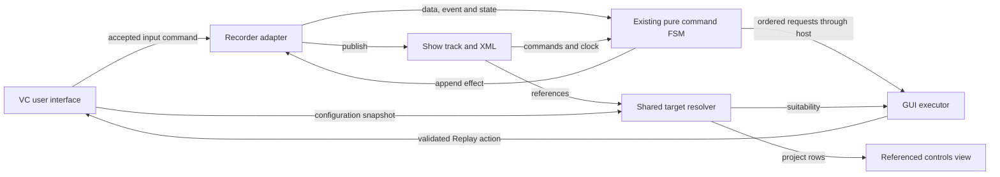
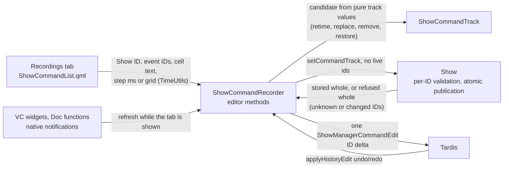
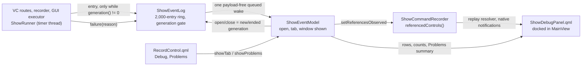

# Implementation ideas and plan

Status: implemented and verified through native/offscreen integration tests. [Requirements](requirements.md) define behavior; [principles](core-principles.md) define ownership; [tests](test-strategy.md) define proof.

## Data and entry points

Typed records include `SetSliderPosition` and `SetButtonState`: Show-relative milliseconds, event order, persistent control identity, expected control type/role and applicable value. Sliders retain mode and attribute kind as compatibility fields. The Show's `CommandTrack` stores named XML fields.

Capture slider position as a fraction from `0` to `1` using the accepted integer value and capture-time range. Exclude function-intensity multiplication and raw MIDI deltas. Replay maps that fraction to the current range and rounds once; reject nonfinite values and non-increasing ranges.

Normalize each accepted interaction into one desired-state command and record it before application. Do not derive records from `valueChanged` or function notifications, or append legacy commands for the same input. Preserve the desired On/Off choice while replacing the old recording-only Monitoring override.

Add explicit state application with `Replay` provenance: `requestStateChange(bool)` currently implements a relative Toggle, so passing the recorded bool to it is insufficient. Resolve the current native state at execution and perform the needed start/stop operation. Bypass MIDI profiles, pickup and raw scaling; page selection must not redirect the saved destination.

## Flow

```mermaid
flowchart LR
    U["VC user interface"] -->|accepted input command| R["Recorder adapter"]
    R -->|data, event and state| F["Existing pure command FSM"]
    F -->|append effect| R
    R -->|publish| S["Show track and XML"]
    S -->|commands and clock| F
    F -->|ordered requests through host| G["GUI executor"]
    G -->|validated Replay action| U
    S -->|references| V["Shared target resolver"]
    U -->|configuration snapshot| V
    V -->|suitability| G
    V -->|project rows| D["Referenced controls view"]
```

Retain every accepted changed slider position in capture, even if output later coalesces them. Dispatch Playing events in order and retain no-echo exclusion for live-authored events.

Superseded by C1 (2026-10-02): Play at a moved/stopped cursor dispatches nothing before it; destination events play once. A requested forward seek sends its crossed interval through the ordered dispatcher in jump mode; a backward move repositions without replay and publishes one rollback batch: the recorder returns the controls its journaled timeline operations changed after the target, the runner its own legacy Start/Stop/SetIntensity effects.

Remove failed checkpoint D's projection model and projection-only hand-back machinery through scoped edits. Preserve CP1/CP2 execution, native dependency receipts, cancellation and the C4 feedback fix. Native controls handle their own relationships; no inferred Offs, owner simulation or conditional preparatory writes.

Cursor movement while paused does no work. Resume without repositioning continues the current traversal. A forward jump skips original time gaps but waits for required native completion without blocking the GUI or lighting thread.

`ShowManager::requestSeek` identifies local seeks; the VDJ connector exposes positions and Play/Pause, not seek intent. Keep that distinction at the adapter. The Flash/global recording extension adds paired momentary events and replay-owned cleanup; see the [recording guide](../show-command-recording.md).

## Work order

| Step | Files or module | Work |
|---|---|---|
| 1 | [`vcbutton`](../../qmlui/virtualconsole/vcbutton.h), existing native control effects | First red/green slice: ON promotes a monitored Scene button to Active, and the Scene survives its Collection stopping. Then cover the other state pairs and idempotence. |
| 2 | [`vcwidget`, `vcslider`, `virtualconsole`](../../qmlui/virtualconsole/), [`showcommandtrack`](../../engine/src/showcommandtrack.h) | Add accepted state capture, persistent identity, shared validation and XML round trip without engine-output sampling. |
| 3 | Existing FSM, [`Show`](../../engine/src/show.h), [`ShowRunner`](../../engine/src/showrunner.h), GUI executor | Integrate Playing progress, cursor repositioning and serial prefix execution. Remove projection-only logic and preserve verified native dispatch/lifetime behavior. |
| 4 | [`ShowCommandRecorder`](../../qmlui/showcommandrecorder.h), [`app.cpp`](../../qmlui/app.cpp), performance-view QML | Share REC state, guard manual selection, handle automatic DJ handover, and checkpoint accepted data for Save/replacement. Grow while armed and finalize content-derived extent. |
| 5 | [`ShowCommandList.qml`](../../qmlui/qml/showmanager/ShowCommandList.qml), Show editor, [`Tardis`](../../qmlui/tardis/tardis.h) | Replace the command overlay with the Recordings tab. Add inline editing, musical step/Snap controls, batch deletion and explicit-target undo (originally through a shared stopped-state gate, removed for recorded events by C5). |
| 6 | Main view, shared debug panel, existing input/commit/execution results | Add Events and Referenced controls tabs, panel-scoped capture and the compact Problems summary. Reuse native configuration notifications. |

Existing input interfaces include `VCSlider::requestUserValue`, `VCButton::requestUserStateChange`, `VCWidget::deliverInput` and `deliverSourceUpdate`. Extend them without observing generic `setValue`.

Add explicit OSC provenance at its accepted input route, alongside MIDI; direct calls from code and function feedback remain non-recording.

### Editor, gate and history (as implemented)

The timeline extension computes typed `ShowCommandGroup` values in the existing
authored track. The recorder adds labels from its existing row resolver.
`ShowRecordingLane.qml` places them in the Show editor's ruler/scroll coordinates
without adding playback Tracks or ShowFunctions. `ShowCommandList.qml` holds
the shared exact-ID selection and existing edit actions; the lane reveals those
IDs in the table. Parent Show-editor visibility owns row observation for both
presentations. Reference-panel observation stays independent.

```mermaid
flowchart LR
    Q["Recordings tab<br/>ShowCommandList.qml"] -->|"Show ID, event IDs, cell text,<br/>step ms or grid (TimeUtils)"| R["ShowCommandRecorder<br/>editor methods"]
    R -->|"candidate from pure track values<br/>(retime, replace, remove, restore)"| T["ShowCommandTrack"]
    R -->|"setCommandTrack, no live ids"| S["Show<br/>per-ID validation, atomic publication"]
    S -->|"stored whole, or refused whole<br/>(unknown or changed IDs)"| R
    R -->|"one ShowManagerCommandEdit<br/>ID delta"| H["Tardis"]
    H -->|"applyHistoryEdit undo/redo"| R
    V["VC widgets, Doc functions<br/>native notifications"] -->|"refresh while the tab is shown"| R
```

The recorder adapter owns editor edits, not the capture FSM: it resolves the explicit Show, builds a candidate track from the track's pure value operations and computes the ID delta. Group movement uses one delta rounded once from the step the UI derives with `TimeUtils.musicalGrid`; Snap puts the earliest event on the nearest beat. Every event keeps its equal-time `order`, so moving away and back restores A before B. Edits and their Undo/Redo publish through `Show::setCommandTrack` with an empty already-applied set: the Show validates the IDs and publishes the whole track atomically, and the recorder's edit session holds the frozen events and the Show's lifetime as its conflict authority. Before C5 the Show decided "fully stopped" and stored edits under the lock that accepts starts; C5 superseded that rule for recorded events. Tardis keeps each edit one step and replays the delta only when every named event still matches, without moving history on refusal. A native step stays what Undo always took: the actions within 150 ms of its newest action. That one partition also counts steps, redoes exactly the step undone, drops undone steps on a new action, evicts whole oldest steps at 100, and bounds coalescing, which moves the merged action to the newest place. Event IDs and orders stay reserved while history can name them. The capture FSM is unchanged.

## UI and save integration

Save checkpoints accepted capture before serialization and any pending workspace replacement. Discard drops unpublished capture through the existing replacement teardown; Cancel keeps the current session. `App::saveWorkspace()` propagates checkpoint and write failures without replacing the workspace. Successful command publication marks the document modified; input accepted after saving remains unsaved.

Derive persisted extent from retained content even during REC. Runtime keepalive supplies the advancing capture lifetime; it must not add a saved empty tail.

Route each shared REC control to the same adapter. Keep capture permission distinct from moving playback: paused/stopped input still records. Editor mutations of recorded events originally required stopped playback and REC off; C5 lets them publish while the Show plays, pauses or records.

Automatic DJ handover uses the same recording FSM: settle accepted A input, finalize A, then publish the B binding and capture epoch. Do not reinterpret queued A input against B or hide a failed finalization by switching anyway.

On failed finalization, disarm capture, retain A's accepted data and report the failure. Continue B's ordinary playback; do not resume recording without rearming.

## Verified feedback behavior to preserve

Keep Adjust `setDMX=false` feedback display-only, with its nonpending rollback baseline. Preserve explicit running reapply and ordinary output requests. C4 has independent evidence; replacing D must not revert it.

Use whole-panel visibility to enable diagnostic capture. Tab changes retain the buffer; close/hide invalidates pending diagnostic callbacks. The Problems indicator consumes failed-operation results without keeping hidden log rows.

### Debug panel (as implemented)

```mermaid
flowchart LR
    P["VC routes, recorder, GUI executor<br/>ShowRunner (timer thread)"] -->|"entry, only while generation() != 0"| L["ShowEventLog<br/>2,000-entry ring, generation gate"]
    P -->|"failure(reason)"| L
    L -->|"one payload-free queued wake"| M["ShowEventModel<br/>open, tab, window shown"]
    M -->|"open/close = new/ended generation"| L
    M -->|"setReferencesObserved"| R["ShowCommandRecorder<br/>referencedControls()"]
    R -->|"replay resolver, native notifications"| V["ShowDebugPanel.qml<br/>docked in MainView"]
    M -->|"rows, counts, Problems summary"| V
    C["RecordControl.qml<br/>Debug, Problems"] -->|"showTab / showProblems"| M
```

`ShowEventLog` (engine) is one process-wide ring. Producers read `generation()` first and build nothing while it is 0; an entry keeps the generation it started under, so a completion after close or reopen is refused. The GUI locks briefly; the timer thread only try-locks and counts a dropped diagnostic. A single atomic flag bounds the queued wake to one across reopen cycles. The failed-operation summary (count, latest reason, which tab) is kept whatever the panel state and reset with the workspace.

`ShowEventModel` (App) owns the panel's open state and tab. It is active while open and the window is shown; each activation opens a fresh generation and the recorder's reference observation, each deactivation (Close, hidden or minimized window, `Doc::clearing`) ends both and drops the rows. Rows are a bounded copy of the current generation read on the wake, appended or removed at the ends so the view keeps its place.

Every entry carries the cause it began under: an accepted request keeps its Show, take, origin and caption as it was accepted, and so do the commands it adds while unpublished. An outcome of a cause the current observation did not see is not shown, nor the extent it derives; a checkpoint begun while open is its own operation with its own trace. Commits report each changed command and the extent, before and after. The rendered panel owns the observation: hiding or unloading it closes it, and Debug on an open panel only focuses it.

Recorded entries follow the existing seams: route rejections (page dispatch, keyboard mapping, pickup, audio triggers, unbound Toggle) and direct code requests reaching an output-producing native control call (`VCButton::requestStateChange`, `VCSlider::setValue` with output) as Input, once, outside the user and Audio wrappers; `requestUserControl`/`reportUnsupported`/`authorAt` decisions; Show publication, extent, editor and history steps as Commit; REC, binding, playing, cursor and clock rewind as Transport; live execution of accepted requests and replay (GUI executor and legacy runner commands) as Execute. A Start/Stop is reported as Requested, never as proof of output. The reference inventory is `referencedControls()`: the tracked Show's `ShowCommandTrack::referencedControls()`, grouped by identity and resolved per role with `ShowCommandFsm::resolveControl`, the rule replay uses. It is observed through the editor's row observer, now enabled by either the Recordings tab or the panel. The panel is opened from the shared REC control in the Show editor, DJ and Virtual Console views.

## Live recording time editing (C5)

- Pure core: `ShowCommandTrack::retimeSelection` returns a retimed copy or a `ShowRetimeRefusal`; `ShowCommandFsm::advance` suppresses a live mark only at its captured time (`ShowLiveMark{time, stopFunctionId}`), and the runner retires a live Stop's clip end once per captured occurrence.
- One authoring owner: `ShowCommandRecorder` publishes recorded-event edits and their Undo/Redo through the non-stopped `Show::setCommandTrack` with no live ids, and owns the single edit session (begin at press, preview, commit, cancel) whose conflict authority is the frozen events and the Show's lifetime.
- Show storage keeps its marks until the traversal ends, stops or seeks; only the runner copy expires by the captured time.
- QML holds pointer geometry and draft text only: one lane-level gesture surface owns drag and stretch handles, table rows are keyed by event id, follow and reveal pause while the pointer holds, and recorded-event editing no longer depends on Perform's read-only flag.
