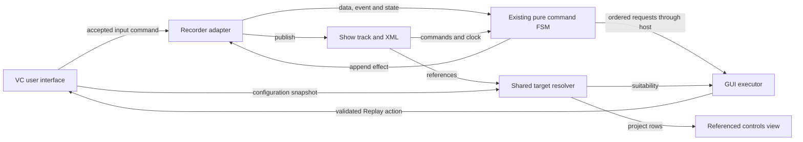

# Implementation ideas and plan

Status: planned. [Requirements](requirements.md) define behavior; [principles](core-principles.md) define ownership; [tests](test-strategy.md) define proof.

## Data and entry points

Extend the existing typed records with `SetSliderPosition` and `SetButtonState`: Show-relative milliseconds, event order, persistent control identity, expected control type/role and applicable value. For sliders, retain mode and attribute kind as compatibility fields. Keep named XML fields; choose the nesting during implementation.

Capture slider position as a fraction from `0` to `1` using the accepted integer value and capture-time range. Exclude function-intensity multiplication and raw MIDI deltas. Replay maps that fraction to the current range and rounds once; reject nonfinite values and non-increasing ranges.

Normalize each accepted interaction into one desired-state command and record it before application. Do not derive records from `valueChanged` or function notifications, or append legacy commands for the same input. Preserve the desired On/Off choice while replacing the old recording-only Monitoring override.

Add explicit state application with `Replay` provenance: `requestStateChange(bool)` currently implements a relative Toggle, so passing the recorded bool to it is insufficient. Resolve the current native state at execution and perform the needed start/stop operation. Bypass MIDI profiles, pickup and raw scaling; page selection must not redirect the saved destination.

## Flow

```mermaid
flowchart LR
    U["VC user interface"] -->|accepted input command| R["Recorder adapter"]
    R -->|data, event and state| F["Existing pure command FSM"]
    F -->|append effect| R
    R -->|publish| S["Show track and XML"]
    S -->|commands and clock| F
    F -->|ordered requests through host| G["GUI executor"]
    G -->|validated Replay action| U
    S -->|references| V["Shared target resolver"]
    U -->|configuration snapshot| V
    V -->|suitability| G
    V -->|project rows| D["Referenced controls view"]
```

Retain every accepted changed slider position in capture, even if output later coalesces them. Dispatch Playing events in order and retain no-echo exclusion for live-authored events.

On Play at a moved/stopped cursor, send the recording's prefix through the existing ordered dispatcher. Include destination events once, then advance past them. A mixed VC recording preserves ordering across both command kinds; keep the legacy-only fallback unchanged.

Remove failed checkpoint D's projection model and projection-only hand-back machinery through scoped edits. Preserve CP1/CP2 execution, native dependency receipts, cancellation and the C4 feedback fix. Native controls handle their own relationships; no inferred Offs, owner simulation or conditional preparatory writes.

Cursor movement while paused does no work. Resume without repositioning continues the current traversal. Catch-up skips original time gaps but waits for required native completion without blocking the GUI or lighting thread.

`ShowManager::requestSeek` identifies local seeks; the VDJ connector exposes positions and Play/Pause, not seek intent. Keep that distinction at the adapter. Flash remains deferred until replay-owned press/release cleanup has a defined contract.

## Work order

| Step | Files or module | Work |
|---|---|---|
| 1 | [`vcbutton`](../../qmlui/virtualconsole/vcbutton.h), existing native control effects | First red/green slice: ON promotes a monitored Scene button to Active, and the Scene survives its Collection stopping. Then cover the other state pairs and idempotence. |
| 2 | [`vcwidget`, `vcslider`, `virtualconsole`](../../qmlui/virtualconsole/), [`showcommandtrack`](../../engine/src/showcommandtrack.h) | Add accepted state capture, persistent identity, shared validation and XML round trip without engine-output sampling. |
| 3 | Existing FSM, [`Show`](../../engine/src/show.h), [`ShowRunner`](../../engine/src/showrunner.h), GUI executor | Integrate Playing progress, cursor repositioning and serial prefix execution. Remove projection-only logic and preserve verified native dispatch/lifetime behavior. |
| 4 | [`ShowCommandRecorder`](../../qmlui/showcommandrecorder.h), [`app.cpp`](../../qmlui/app.cpp), performance-view QML | Share REC state, guard manual selection, handle automatic DJ handover, and checkpoint accepted data for Save/replacement. Grow while armed and finalize content-derived extent. |
| 5 | [`ShowCommandList.qml`](../../qmlui/qml/showmanager/ShowCommandList.qml), Show editor, [`Tardis`](../../qmlui/tardis/tardis.h) | Replace the command overlay with the Recordings tab. Add inline editing, musical step/Snap controls, batch deletion and explicit-target undo through the shared stopped-state gate. |
| 6 | Main view, shared debug panel, existing input/commit/execution results | Add Events and Referenced controls tabs, panel-scoped capture and the compact Problems summary. Reuse native configuration notifications. |

Existing input interfaces include `VCSlider::requestUserValue`, `VCButton::requestUserStateChange`, `VCWidget::deliverInput` and `deliverSourceUpdate`. Extend them without observing generic `setValue`.

Add explicit OSC provenance at its accepted input route, alongside MIDI; direct calls from code and function feedback remain non-recording.

Keep the target Show ID and an event-ID delta with each edit. Preflight affected fields/existence, publish once, and undo only that delta. Preserve intervening capture and tie order; do not reuse event IDs while history can refer to them. Reuse caption/binding notifications and `Show::commandTrackChanged`.

For musical movement, the UI sends selected event IDs, direction/step or Snap intent to the existing edit FSM. Reuse Show meter/tempo and the VDJ grid offset through `TimeUtils.js` and the Show editor's grid data. Compute one delta from the original selection, snap its earliest time once, then validate and publish the group. Keep saved timestamps in milliseconds and avoid repeated rounding of each event.

## UI and save integration

Reuse existing Save / Discard / Cancel handling. Add capture settlement before serialization or workspace replacement; the current `App::saveWorkspace()` path does not establish that guarantee. Verify command publication marks the document modified and that post-checkpoint input remains unsaved.

Derive persisted extent from retained content even during REC. Runtime keepalive supplies the advancing capture lifetime; it must not add a saved empty tail.

Route each shared REC control to the same adapter. Keep capture permission distinct from moving playback: paused/stopped input still records, while editor mutations require stopped playback and REC off.

Automatic DJ handover uses the same recording FSM: settle accepted A input, finalize A, then publish the B binding and capture epoch. Do not reinterpret queued A input against B or hide a failed finalization by switching anyway.

On failed finalization, disarm capture, retain A's accepted data and report the failure. Continue B's ordinary playback; do not resume recording without rearming.

## Verified feedback behavior to preserve

Keep Adjust `setDMX=false` feedback display-only, with its nonpending rollback baseline. Preserve explicit running reapply and ordinary output requests. C4 has independent evidence; replacing D must not revert it.

Use whole-panel visibility to enable diagnostic capture. Tab changes retain the buffer; close/hide invalidates pending diagnostic callbacks. The Problems indicator consumes failed-operation results without keeping hidden log rows.
