# QLC+ MCP Server — Architecture & Visualization

> Auto-generated analysis of the MCP server in this project.
> Source files referenced: [`mcp/`](../mcp/)

---

## 1. Layered Overview

Shows how an AI agent request flows from HTTP through MCP protocol, tool dispatch,
the VCBridge abstraction, and into the QLC+ engine.

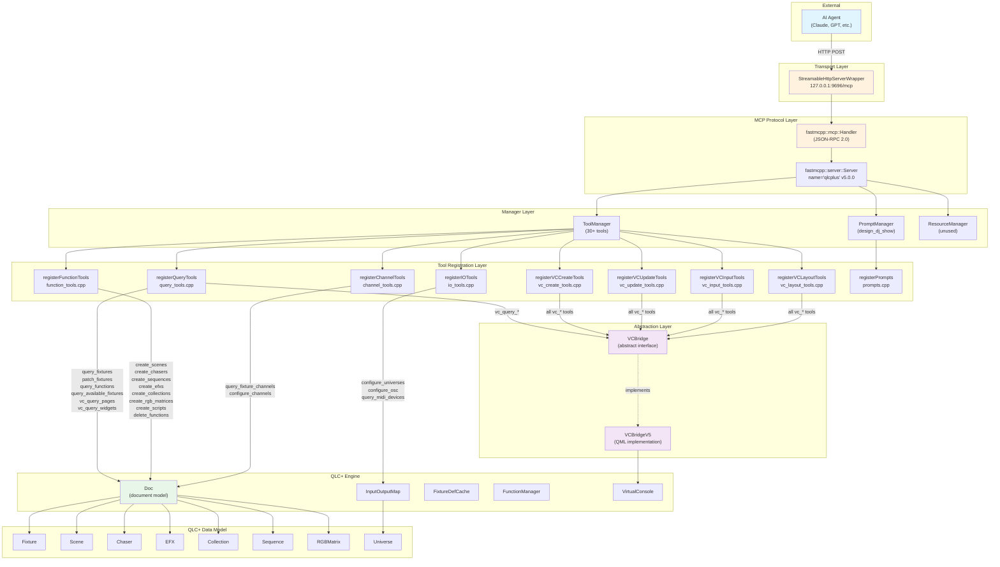

### Initialization Sequence

```mermaid
sequenceDiagram
    participant Main as qmlui/main.cpp
    participant Init as mcpinit.cpp
    participant Bridge as VCBridgeV5
    participant Server as McpServer
    participant HTTP as StreamableHttpServer
    participant TM as ToolManager

    Main->>Init: mcpInit(doc, vc, funcMgr, parser)
    Init->>Init: Check --no-mcp flag
    
    alt vc != nullptr
        Init->>Bridge: new VCBridgeV5(doc, vc)
    else vc == nullptr
        Note over Init: vcBridge stays nullptr<br/>VC tools won't register
    end
    
    Init->>Server: new McpServer(doc, vcBridge, funcMgr)
    
    Server->>TM: registerQueryTools(tm, doc, vcBridge)
    Note over TM: query_fixtures, patch_fixtures<br/>always registered
    Note over TM: vc_query_pages, vc_query_widgets<br/>only if vcBridge != null

    Server->>TM: registerFunctionTools(tm, doc, funcMgr)
    Server->>TM: registerVCCreateTools(tm, doc, vcBridge)
    Note over TM: if (!vcBridge) return; // guard
    Server->>TM: registerVCUpdateTools(tm, doc, vcBridge)
    Server->>TM: registerVCInputTools(tm, doc, vcBridge)
    Server->>TM: registerVCLayoutTools(tm, doc, vcBridge)
    Server->>TM: registerIOTools(tm, doc)
    Server->>TM: registerChannelTools(tm, doc)
    Server->>TM: registerPrompts(pm, doc)

    Init->>Server: startHttp(port)
    Server->>HTTP: new StreamableHttpServerWrapper(handler, "127.0.0.1", port, "/mcp")
    HTTP->>HTTP: start()
    Note over HTTP: Listening on http://127.0.0.1:9696/mcp
```

**Ref:** [mcpinit.cpp](mcpinit.cpp) | [mcpserver.cpp](mcpserver.cpp) | [tool_registry.h](tools/tool_registry.h)

---

## 2. Tool Inventory — Complete Map

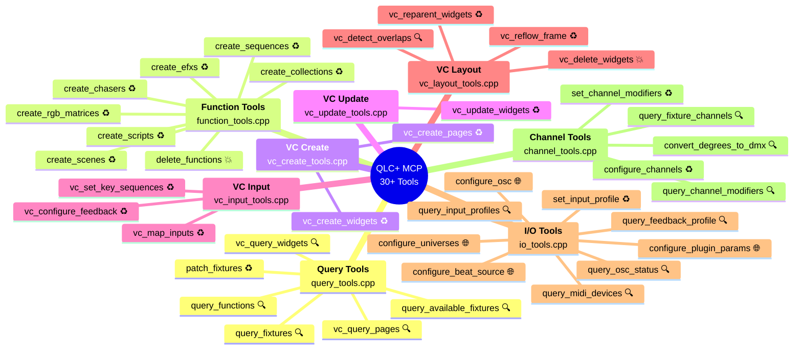

**Legend:** 🔍 = readOnly | ♻️ = idempotent | 💥 = destructive | 🌐 = openWorld

---

## 3. Query Tools — Detail

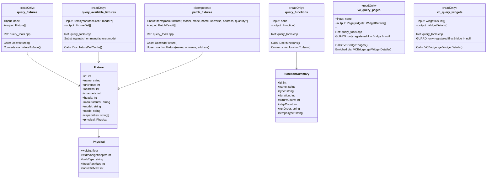

**Ref:** [query_tools.cpp](tools/query_tools.cpp) | [conversions.h](tools/conversions.h)

---

## 4. Function Tools — Detail

```mermaid
classDiagram
    class create_scenes {
        <<idempotent>>
        +name: string ⚠️required
        +fixtureIDs: int[]
        +fixtureNames: string[] (glob)
        +fadeIn/fadeOut: int (ms)
        +channelValues: ChannelValue[]
        +positions: Position[]
        --
        Ref: function_tools.cpp
        Upsert: findFunction(name, SceneType)
        On upsert: scene.clear() then re-apply
        Engine: Scene::setValue(SceneValue)
        Engine: Fixture::positionToValues()
    }

    class create_chasers {
        <<idempotent>>
        +name: string
        +steps: ChaserStep[]
        +tempoType: "time"|"beats"
        +runOrder: "loop"|"singleshot"|"pingpong"|"random"
        +direction: "forward"|"backward"
        --
        Ref: function_tools.cpp
        Upsert: findFunction(name, ChaserType)
        Engine: Chaser::addStep(ChaserStep)
        Beat encoding: 1000=1beat
    }

    class create_sequences {
        <<idempotent>>
        +name: string
        +boundSceneID / boundSceneName: int|string
        +fadeIn/fadeOut/holdTime: int
        +runOrder/direction: string
        --
        Ref: function_tools.cpp
        Engine: Sequence::setBoundSceneID()
        ⚠️ Sequence is subclass of Chaser
    }

    class create_efxs {
        <<idempotent>>
        +name: string
        +fixtureIDs / fixtureNames
        +algorithm: enum
        +width/height: int (0-255)
        +xOffset/yOffset: int
        +rotation: int (0-360)
        +speed/duration: int
        +propagationMode: "parallel"|"serial"|"asymmetric"
        --
        Algorithms: Circle, Eight, Line, Diamond,
        Square, SquareChoppy, Leaf, Lissajous,
        Triangle, SquareTrue
        Engine: EFX::addFixture(EFXFixture)
    }

    class create_collections {
        <<idempotent>>
        +name: string
        +functionIDs: int[]
        +functionNames: string[]
        --
        Ref: function_tools.cpp
        Engine: Collection::addFunction()
        Resolves names via resolveFunctionByName()
    }

    class create_rgb_matrices {
        <<idempotent>>
        +name: string
        +fixtureGroupID / fixtureGroupName
        +algorithm: string
        +startColor/endColor: hex color
        +fadeIn/fadeOut: int
        +runOrder/direction: string
        --
        Ref: function_tools.cpp
        Engine: RGBMatrix::setAlgorithm()
        Requires a FixtureGroup
    }

    class create_scripts {
        <<idempotent>>
        +name: string
        +commands: string[]
        --
        Ref: function_tools.cpp
        Engine: Script::setData()
    }

    class delete_functions {
        <<destructive>>
        +functionIDs: int[]
        +functionNames: string[]
        --
        Ref: function_tools.cpp
        Engine: Doc::deleteFunction()
    }

    class ChannelValue {
        +fixtureID: int
        +channel: int
        +value: int (0-255)
    }

    class Position {
        +fixtureID: int
        +panDegrees: float
        +tiltDegrees: float
        +zoomDegrees: float
    }

    class ChaserStep {
        +functionID / functionName
        +fadeIn/hold/fadeOut: int
        +note: string
    }

    create_scenes --> ChannelValue
    create_scenes --> Position
    create_chasers --> ChaserStep
```

**Ref:** [function_tools.cpp](tools/function_tools.cpp) | [idempotency.h](tools/idempotency.h)

---

## 5. Virtual Console Tools — Widget Type Map

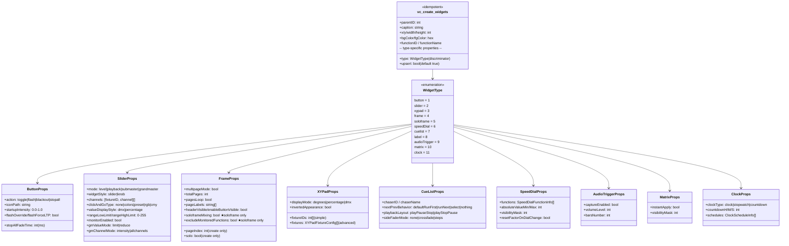

**Ref:** [vc_create_tools.cpp](tools/vc_create_tools.cpp) | [vc_tools_common.h](tools/vc_tools_common.h)

---

## 6. VC Input Mapping & Feedback

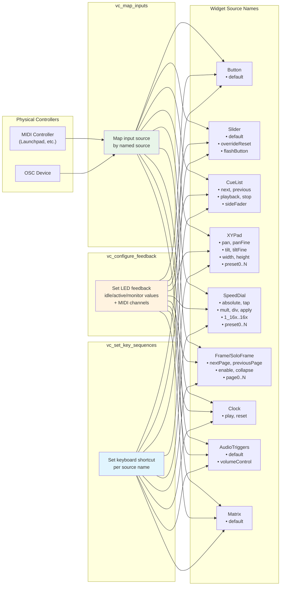

**Ref:** [vc_input_tools.cpp](tools/vc_input_tools.cpp)

---

## 7. I/O & Channel Tools

```mermaid
flowchart TB
    subgraph "Universe Configuration"
        CU["configure_universes<br/>Set input/output plugin per universe<br/>ArtNet, E1.31, OSC, MIDI"]
        CP["configure_plugin_params<br/>Set plugin-specific params<br/>(initmessage, midichannel)"]
        CO["configure_osc<br/>One-call OSC setup<br/>(ports, IPs, feedback)"]
        CB["configure_beat_source<br/>Set internal/MIDI beat source"]
    end

    subgraph "Profile Management"
        QIP["query_input_profiles 🔍"]
        SIP["set_input_profile ♻️"]
        QFP["query_feedback_profile 🔍<br/>Color table + MIDI channel table"]
    end

    subgraph "Device Discovery"
        QMD["query_midi_devices 🔍<br/>List all plugins + ports"]
        QOS["query_osc_status 🔍"]
    end

    subgraph "Channel Tools"
        QFC["query_fixture_channels 🔍<br/>Per-channel capabilities,<br/>DMX ranges, presets"]
        CC["configure_channels ♻️<br/>Set precedence: auto/htp/ltp<br/>Set canFade per channel"]
        QCM["query_channel_modifiers 🔍<br/>List modifier templates"]
        SCM["set_channel_modifiers ♻️<br/>Apply modifier to channel"]
        CDM["convert_degrees_to_dmx 🔍<br/>Pan/tilt degree→DMX conversion"]
    end

    subgraph "QLC+ Engine"
        IOM["InputOutputMap"]
        IOC["IOPluginCache"]
        UNI["Universe"]
        FIX["Fixture"]
    end

    CU --> IOM
    CP --> IOC
    CO --> IOM
    CO --> IOC
    CB --> IOM
    QMD --> IOC
    QOS --> IOC
    QIP --> IOM
    SIP --> IOM
    QFP --> IOM
    QFC --> FIX
    CC --> FIX
    QCM --> FIX
    SCM --> FIX
    CDM --> FIX
    IOM --> UNI
```

**Ref:** [io_tools.cpp](tools/io_tools.cpp) | [channel_tools.cpp](tools/channel_tools.cpp) | [conversions.h](tools/conversions.h)

---

## 8. VCBridge Abstraction — Interface vs Implementation

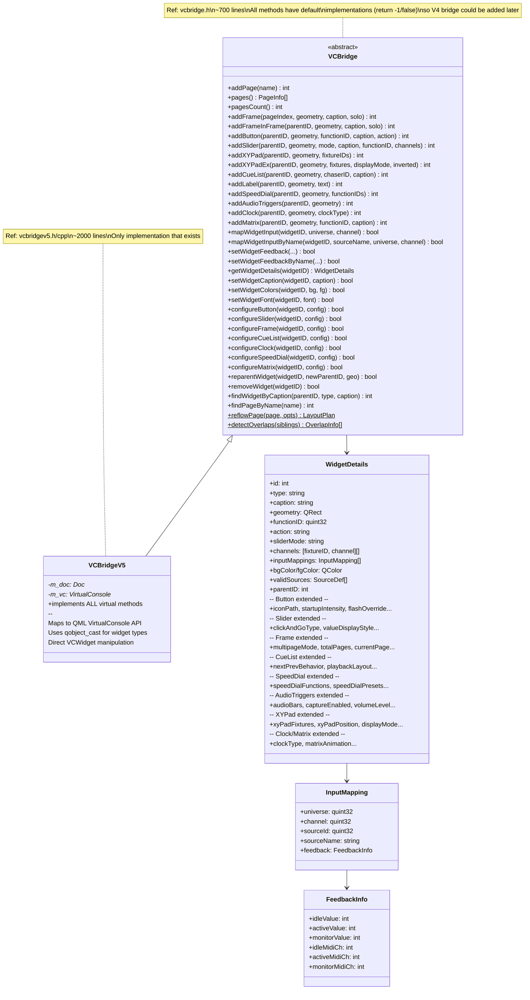

**Ref:** [vcbridge.h](vcbridge.h) | [vcbridgev5.h](vcbridgev5.h) | [vcbridgev5.cpp](vcbridgev5.cpp)

---

## 9. Thread Safety Model

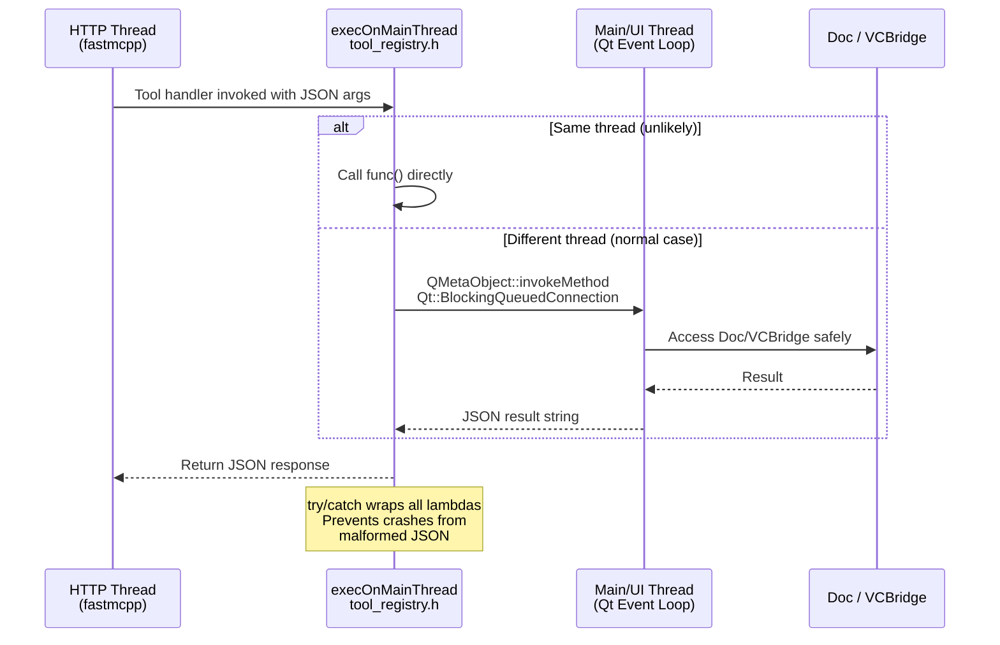

**Ref:** [tool_registry.h](tools/tool_registry.h) — `execOnMainThread()` template

---

## 10. Idempotency & Resolution Strategy

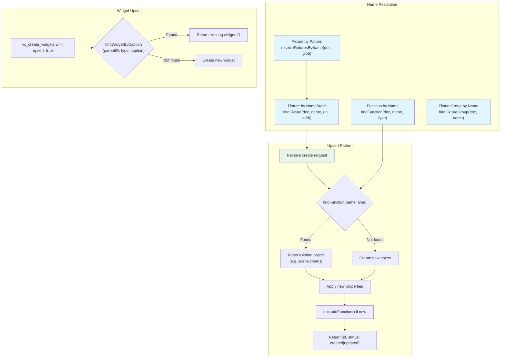

**Ref:** [idempotency.h](tools/idempotency.h)

---

## 11. Field Validation Pipeline

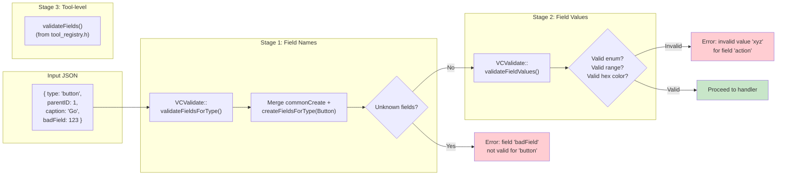

**Ref:** [vc_tools_common.h](tools/vc_tools_common.h) — `VCValidate` namespace | [tool_registry.h](tools/tool_registry.h) — `validateFields()`

---

## 12. Recommended Workflow

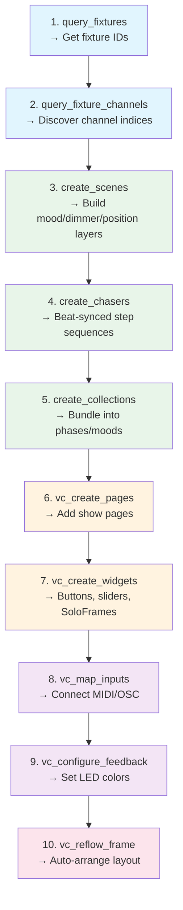

**Ref:** Server instructions in [mcpserver.cpp](mcpserver.cpp) | Prompt `design_dj_show` in [prompts.cpp](tools/prompts.cpp)

---

## 13. Potential Issues & Wiring Analysis

```mermaid
flowchart TB
    subgraph "🔴 Memory Leak"
        ML1["mcpinit.cpp:31<br/>McpServer *server = new McpServer(...)"]
        ML2["mcpinit.cpp:27<br/>VCBridgeV5 *vcBridge = new VCBridgeV5(...)"]
        ML3["Neither object is ever deleted<br/>No parent QObject set"]
        ML1 --> ML3
        ML2 --> ML3
    end

    subgraph "🟡 ResourceManager Unused"
        RM1["mcpserver.cpp:39<br/>m_resourceManager(make_unique)"]
        RM2["Never has anything registered<br/>Empty manager passed to handler"]
        RM1 --> RM2
    end

    subgraph "🟡 FunctionManager Nullable"
        FM1["McpServer(doc, vcBridge,<br/>funcMgr = nullptr)"]
        FM2["registerFunctionTools(tm, doc, funcMgr)"]
        FM3{"Is funcMgr used<br/>inside function_tools.cpp?"}
        FM4["funcMgr parameter captured<br/>but only used in<br/>create_rgb_matrices for<br/>FunctionManager-specific ops"]
        FM1 --> FM2 --> FM3 --> FM4
    end

    subgraph "🟢 VC Null Guards — Correct"
        NG1["registerVCCreateTools: if (!vcBridge) return ✓"]
        NG2["registerVCUpdateTools: if (!vcBridge) return ✓"]
        NG3["registerVCInputTools: if (!vcBridge) return ✓"]
        NG4["registerVCLayoutTools: if (!vcBridge) return ✓"]
        NG5["vc_query_pages: if (vcBridge) { register } ✓"]
        NG6["vc_query_widgets: if (vcBridge) { register } ✓"]
    end

    subgraph "🟡 Tool Registration Comment Mismatch"
        CM1["io_tools.cpp:107<br/>Comment says 'query_midi_devices'<br/>but registers 'configure_plugin_params'"]
        CM2["Duplicate comment 'query_midi_devices'<br/>appears at both line 107 and line 165"]
        CM1 --> CM2
    end

    subgraph "🟡 const_cast Pattern"
        CC1["query_tools.cpp:95<br/>const_cast&lt;QLCFixtureDef*&gt;(def)->modes()"]
        CC2["Needed because modes() is non-const<br/>Could break if def is truly const"]
        CC1 --> CC2
    end

    subgraph "🟢 Thread Safety — Correct"
        TS1["All tool handlers wrapped in<br/>execOnMainThread(doc, [&]() {...})"]
        TS2["Uses Qt::BlockingQueuedConnection<br/>when threads differ"]
        TS3["try/catch prevents crashes"]
        TS1 --> TS2 --> TS3
    end

    style ML3 fill:#ffcdd2
    style RM2 fill:#fff9c4
    style FM4 fill:#fff9c4
    style CM2 fill:#fff9c4
    style CC2 fill:#fff9c4
    style NG1 fill:#c8e6c9
    style NG2 fill:#c8e6c9
    style NG3 fill:#c8e6c9
    style NG4 fill:#c8e6c9
    style NG5 fill:#c8e6c9
    style NG6 fill:#c8e6c9
    style TS3 fill:#c8e6c9
```

### Issue Detail Table

| # | Severity | Location | Issue | Impact |
|---|----------|----------|-------|--------|
| 1 | 🔴 High | [mcpinit.cpp:27-32](mcpinit.cpp) | `McpServer` and `VCBridgeV5` allocated with `new` but never `delete`d. No QObject parent set. | Memory leak for app lifetime. Minor since both live until app exit, but prevents clean shutdown. |
| 2 | 🟡 Medium | [mcpserver.cpp:39](mcpserver.cpp) | `ResourceManager` created but nothing is ever registered in it. | Dead code. No functional impact but adds confusion. |
| 3 | 🟡 Medium | [io_tools.cpp:107](tools/io_tools.cpp) | Comment says `// query_midi_devices` but the code registers `configure_plugin_params`. The actual `query_midi_devices` is registered at line 165 with the same comment duplicated. | Misleading for developers reading the code. |
| 4 | 🟡 Medium | [query_tools.cpp:95](tools/query_tools.cpp) | `const_cast<QLCFixtureDef*>(def)->modes()` — discards const to call `modes()`. | `modes()` should be const on `QLCFixtureDef`. Works but is a code smell. |
| 5 | 🟢 Info | [tool_registry.h](tools/tool_registry.h) | `validateFields()` uses linear scan over `initializer_list`. | O(n×m) complexity. Fine for small field counts (< 20) but not optimal. |
| 6 | 🟢 Info | [vcbridge.h](vcbridge.h) | `WidgetDetails` struct has ~40 fields for all widget types combined. | No runtime cost; sparse struct pattern is intentional. Could use variant/union for stricter typing. |
| 7 | 🟢 OK | All vc_*.cpp | All VC registration functions guard `if (!vcBridge) return;` | Correctly handles null VCBridge — tools simply won't be registered. |
| 8 | 🟢 OK | All tool handlers | All wrapped in `execOnMainThread()` | Thread safety between HTTP thread and Qt main thread is correct. |
| 9 | 🟢 OK | All create tools | Idempotent upsert pattern via `findFunction()` / `findWidgetByCaption()` | Safe to call repeatedly. |

---

## 14. File Reference Map

| File | Purpose | Lines | Tools Registered |
|------|---------|-------|-----------------|
| [mcpserver.h](mcpserver.h) | Server class declaration | ~40 | — |
| [mcpserver.cpp](mcpserver.cpp) | Server init, HTTP lifecycle | ~70 | Orchestrates all registration |
| [mcpinit.h](mcpinit.h) / [.cpp](mcpinit.cpp) | CLI options, startup wiring | ~35 | — |
| [vcbridge.h](vcbridge.h) | Abstract VC interface | ~700 | — |
| [vcbridgev5.h](vcbridgev5.h) / [.cpp](vcbridgev5.cpp) | QML VC implementation | ~2000 | — |
| [tools/tool_registry.h](tools/tool_registry.h) | Registration decls, `execOnMainThread`, `validateFields` | ~100 | — |
| [tools/conversions.h](tools/conversions.h) | JSON conversion functions | ~250 | — |
| [tools/idempotency.h](tools/idempotency.h) | Upsert helpers, name resolution, glob | ~100 | — |
| [tools/vc_tools_common.h](tools/vc_tools_common.h) | Widget type enum, field validation | ~400 | — |
| [tools/query_tools.cpp](tools/query_tools.cpp) | Query & patch tools | ~400 | 6: query_fixtures, query_available_fixtures, patch_fixtures, query_functions, vc_query_pages, vc_query_widgets |
| [tools/function_tools.cpp](tools/function_tools.cpp) | Function CRUD | ~800 | 8: create_scenes, create_chasers, create_sequences, create_efxs, create_collections, create_rgb_matrices, create_scripts, delete_functions |
| [tools/vc_create_tools.cpp](tools/vc_create_tools.cpp) | Widget creation | ~600 | 2: vc_create_pages, vc_create_widgets |
| [tools/vc_update_tools.cpp](tools/vc_update_tools.cpp) | Sparse widget updates | ~400 | 1: vc_update_widgets |
| [tools/vc_input_tools.cpp](tools/vc_input_tools.cpp) | Input mapping & feedback | ~400 | 3: vc_map_inputs, vc_configure_feedback, vc_set_key_sequences |
| [tools/vc_layout_tools.cpp](tools/vc_layout_tools.cpp) | Layout operations | ~350 | 4: vc_reparent_widgets, vc_delete_widgets, vc_detect_overlaps, vc_reflow_frame |
| [tools/io_tools.cpp](tools/io_tools.cpp) | I/O & universe config | ~500 | 9: configure_universes, configure_plugin_params, query_midi_devices, query_input_profiles, set_input_profile, query_feedback_profile, configure_osc, query_osc_status, configure_beat_source |
| [tools/channel_tools.cpp](tools/channel_tools.cpp) | Channel queries & config | ~300 | 5: query_fixture_channels, configure_channels, query_channel_modifiers, set_channel_modifiers, convert_degrees_to_dmx |
| [tools/prompts.cpp](tools/prompts.cpp) | MCP prompts | ~100 | 1 prompt: design_dj_show |
| [CMakeLists.txt](CMakeLists.txt) | Build configuration | ~50 | — |

**Total: ~34 tools, 1 prompt, 0 resources**
