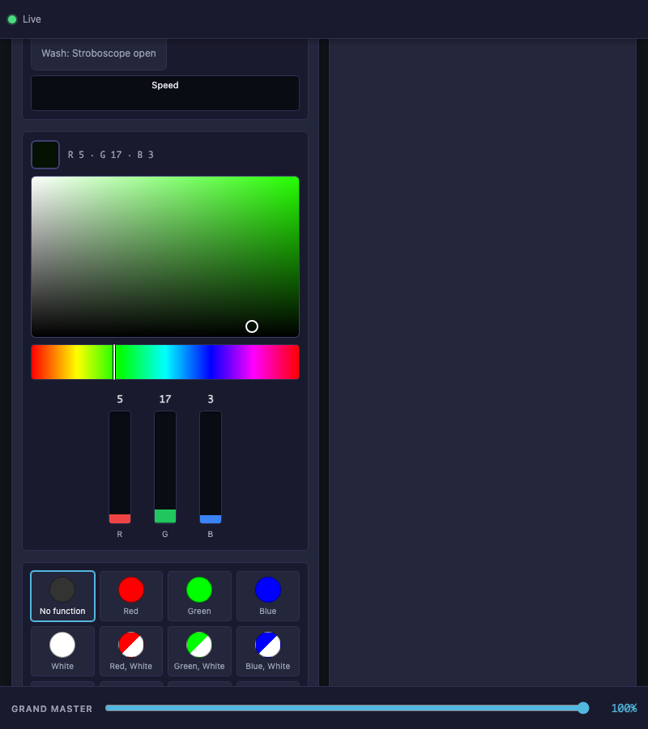
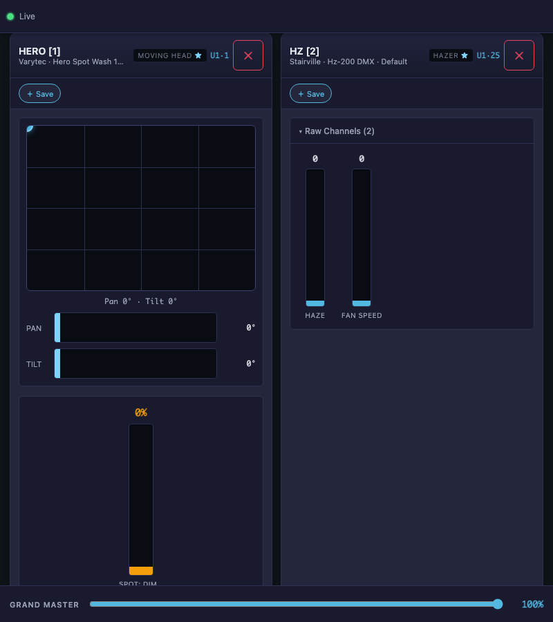

# DMX Web Control — Feature Screenshots

Generated: 2026-04-25T12:06:42

---

## DMX Control — Direct Load (T1, T3)

The web app loads directly into DMX Control. No Virtual Console tab bar — this is a dedicated fixture control surface.

---

## Fixtures Sorted by DMX Address (T5)

Fixtures are ordered by universe and DMX address: U1·1, U1·25, U1·27, U1·201, U2·1...

---

## Filter by Model (T9)

Filter badges show fixture models: All, Beam Ball 100 Quad LED, Hero Spot Wash 140 2in1 RGBW+W, Hz-200 DMX, RGBPanel, Thunderwash 600 UV. Click to filter — only matching fixtures remain visible.

---

## Collapsible Universe Groups (T6)

Fixtures can be grouped by universe. Click the header to collapse/expand. State persists in localStorage.

---

## Controls Sorted by Channel Index (T4)

Within each fixture, controls appear in DMX channel order — matching the fixture definition.

---

## Raw-Only Fixtures Auto-Open + Star (T7)

The HZ hazer has only raw channels (no color picker, no dimmer). Its raw section opens by default. A ★ star indicates uncovered channels.

---

## Raw Channels — ALL Channels with Read-Only Monitors (T8)

HERO shows all 23 channels in raw view. 15 channels are read-only 🔒 (already controlled by color picker, position pad, etc.). Uncovered channels are fully interactive.

---

## Cross-Tab Sync — Color Picker (Proof)

**Tab A** changes the color picker to a vivid color. **Tab B** (independent browser tab) receives the DMX delta via WebSocket and updates its color picker — swatch, RGB values, hue bar cursor, and crosshair all sync.

Tab A RGB: `R 5 · G 17 · B 3`  
Tab B RGB: `R 5 · G 17 · B 3`

---

## Cross-Tab Sync — Position XY Pad (Proof)

**Tab A** moves the pan/tilt XY pad. **Tab B** shows the cursor move to the same position.

Tab A: `Pan 405° · Tilt 48°`  
Tab B: `Pan 405° · Tilt 48°`

---

## Cross-Tab Sync — Dimmer Fader (Proof)

**Tab A** sets the HERO dimmer to 8%. **Tab B** reflects the change: 8%. Both tabs share the same DMX universe via WebSocket.

---
