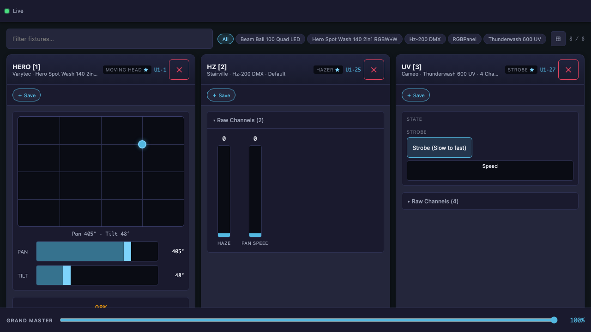
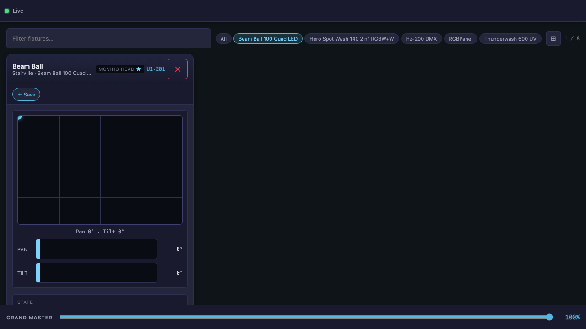
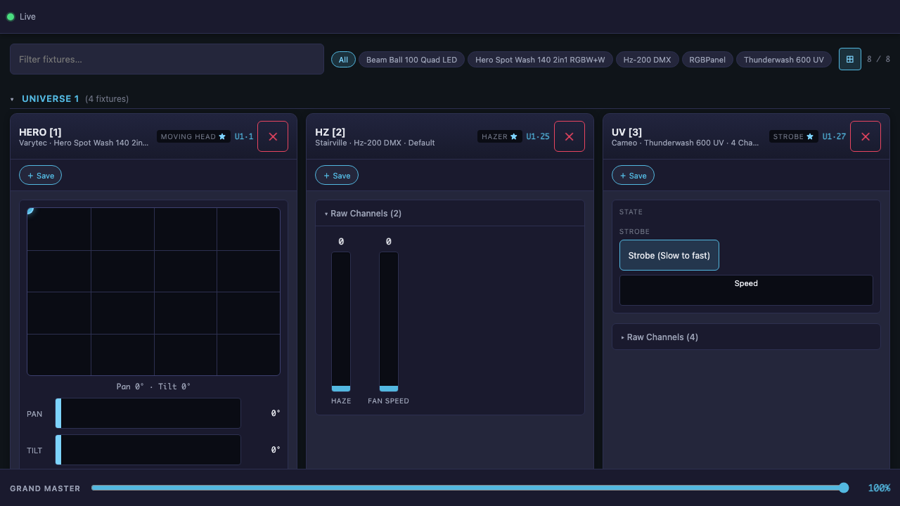
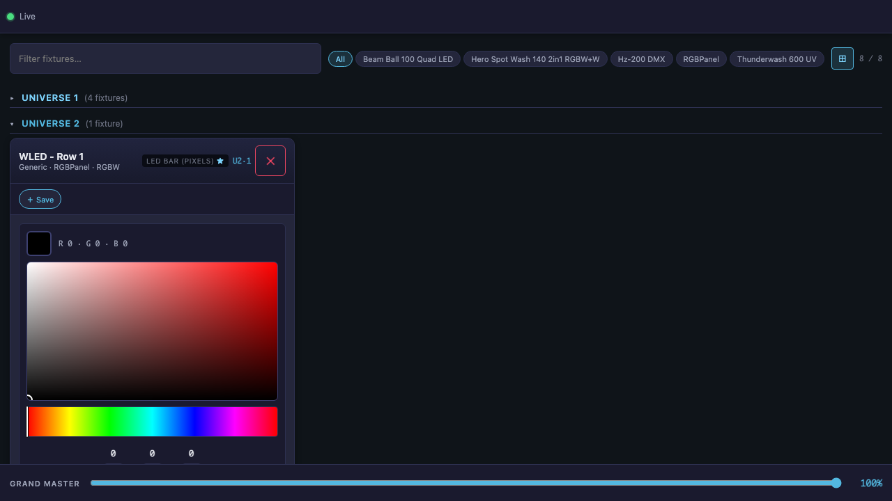
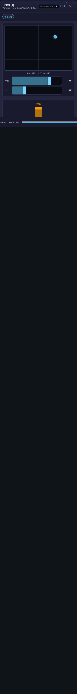
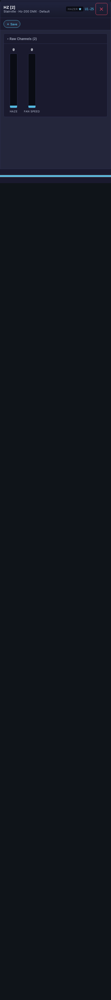
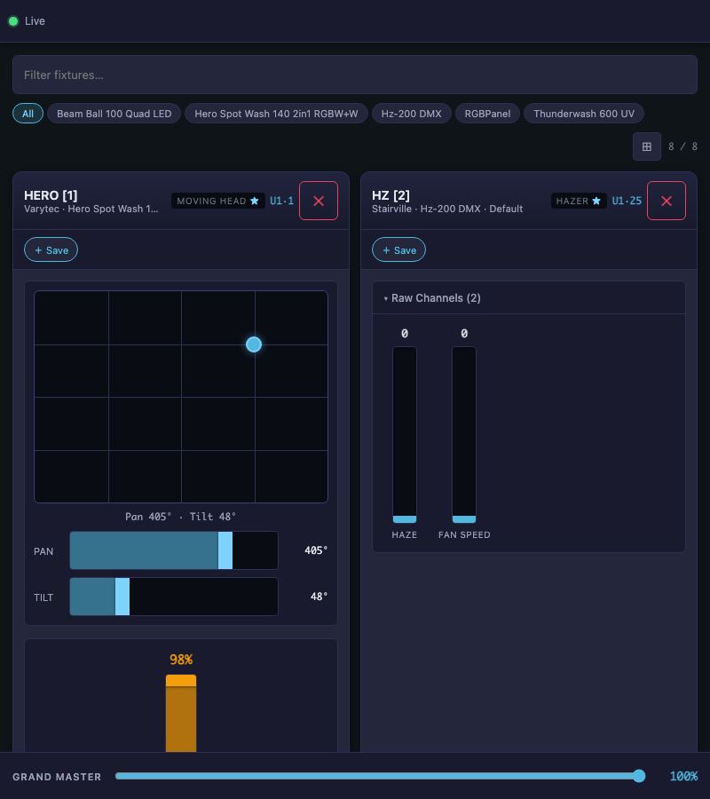
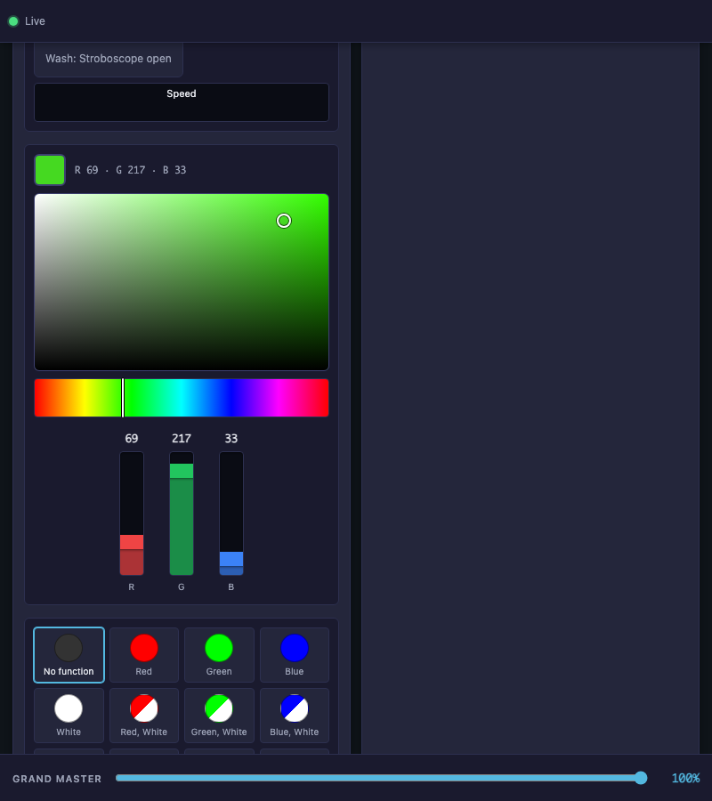
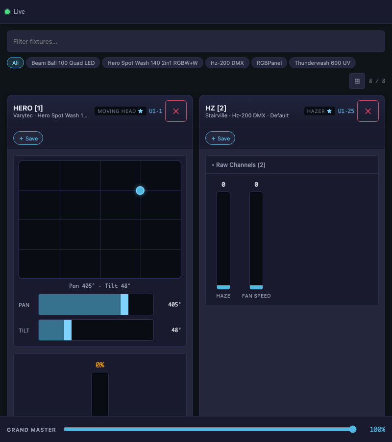
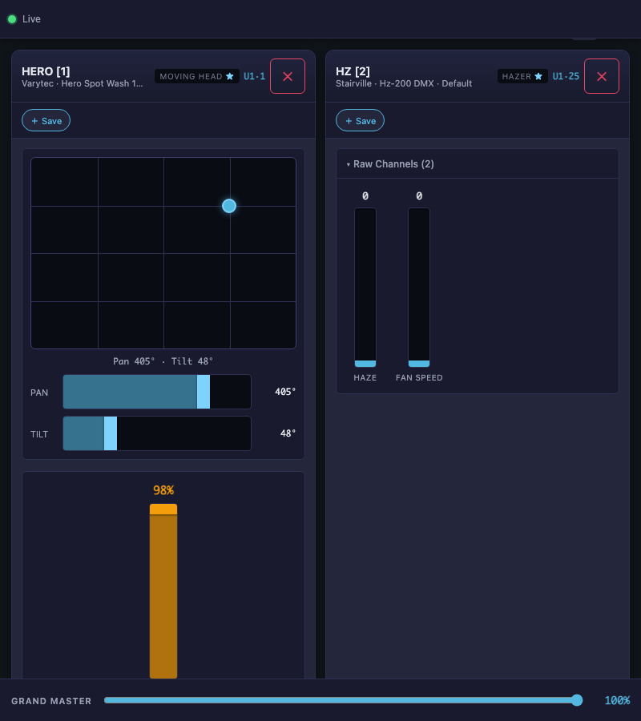

# 🎛️ DMX Web Control — Test Report

> Generated: **2026-04-25 12:38:37**  
> Duration: **31.1s** | Status: **passed**  
> Tests: **14** passed, **0** failed, **0** skipped — **14** total

## Summary

| Status | Test | Duration |
|--------|------|----------|
| ✅ | T1+T3: DMX Control loads directly — no VC tab 📸×1 | 1598ms |
| ✅ | T5: Fixtures sorted by DMX address 📸×1 | 1441ms |
| ✅ | T9: Model-based filter badges 📸×2 | 2007ms |
| ✅ | T6: Collapsible universe groups 📸×2 | 2456ms |
| ✅ | Cross-tab color sync animation 📸×6 | 8998ms |
| ✅ | T4: Controls sorted by channel index 📸×1 | 1886ms |
| ✅ | T7: Auto-open raw + star for raw-only fixtures 📸×1 | 1868ms |
| ✅ | T8: Raw channels = ALL channels with read-only monitors 📸×1 | 2123ms |
| ✅ | Cross-tab position sync animation 📸×6 | 8222ms |
| ✅ | Cross-tab sync: color picker change propagates 📸×3 | 5944ms |
| ✅ | Cross-tab sync: position pad change propagates 📸×3 | 5573ms |
| ✅ | Cross-tab fader sync animation 📸×6 | 8179ms |
| ✅ | Feature walkthrough animation 📸×7 | 4826ms |
| ✅ | Cross-tab sync: fader change propagates 📸×3 | 5584ms |

---

## chromium › screenshot-docs.spec.ts › Feature Screenshots

### ✅ T1+T3: DMX Control loads directly — no VC tab

- **File:** `e2e/screenshot-docs.spec.ts:43`
- **Duration:** 1598ms

**01-dmx-only**

---

### ✅ T5: Fixtures sorted by DMX address

- **File:** `e2e/screenshot-docs.spec.ts:49`
- **Duration:** 1441ms

**02-fixture-order**

---

### ✅ T9: Model-based filter badges

- **File:** `e2e/screenshot-docs.spec.ts:54`
- **Duration:** 2007ms

**03-model-filter-all**

**03-model-filter-active**

---

### ✅ T6: Collapsible universe groups

- **File:** `e2e/screenshot-docs.spec.ts:66`
- **Duration:** 2456ms

**04-universe-expanded**

**04-universe-collapsed**

---

### ✅ T4: Controls sorted by channel index

- **File:** `e2e/screenshot-docs.spec.ts:80`
- **Duration:** 1886ms

**05-channel-order**

---

### ✅ T7: Auto-open raw + star for raw-only fixtures

- **File:** `e2e/screenshot-docs.spec.ts:88`
- **Duration:** 1868ms

**06-raw-auto-open**

---

### ✅ T8: Raw channels = ALL channels with read-only monitors

- **File:** `e2e/screenshot-docs.spec.ts:96`
- **Duration:** 2123ms

**07-raw-all-channels**

---

### ✅ Cross-tab sync: color picker change propagates

- **File:** `e2e/screenshot-docs.spec.ts:113`
- **Duration:** 5944ms

**08-sync-color-before-tabB**

**08-sync-color-tabA-changed**

**08-sync-color-after-tabB**

---

### ✅ Cross-tab sync: position pad change propagates

- **File:** `e2e/screenshot-docs.spec.ts:152`
- **Duration:** 5573ms

**09-sync-pos-before-tabB**

**09-sync-pos-tabA-changed**

**09-sync-pos-after-tabB**

---

### ✅ Cross-tab sync: fader change propagates

- **File:** `e2e/screenshot-docs.spec.ts:184`
- **Duration:** 5584ms

**10-sync-fader-before-tabB**

**10-sync-fader-tabA-changed**

**10-sync-fader-after-tabB**

---

## chromium › animated-docs.spec.ts › Animated Documentation

### ✅ Cross-tab color sync animation

- **File:** `e2e/animated-docs.spec.ts:52`
- **Duration:** 8998ms

**color-sync-01-before**

**color-sync-02-tabA-set**

**color-sync-03-tabB-synced**

**color-sync-04-tabA-changed**

**color-sync-05-tabB-updated**

**cross-tab-color-sync**

---

### ✅ Cross-tab position sync animation

- **File:** `e2e/animated-docs.spec.ts:114`
- **Duration:** 8222ms

**pos-sync-01-before**

**pos-sync-02-tabA-moved**

**pos-sync-03-tabB-synced**

**pos-sync-04-tabA-moved2**

**pos-sync-05-tabB-synced2**

**cross-tab-position-sync**

---

### ✅ Cross-tab fader sync animation

- **File:** `e2e/animated-docs.spec.ts:164`
- **Duration:** 8179ms

**fader-sync-01-before**

**fader-sync-02-tabA-high**

**fader-sync-03-tabB-synced**

**fader-sync-04-tabA-mid**

**fader-sync-05-tabB-synced2**

**cross-tab-fader-sync**

---

### ✅ Feature walkthrough animation

- **File:** `e2e/animated-docs.spec.ts:214`
- **Duration:** 4826ms

**walkthrough-01-initial**

**walkthrough-02-filtered**

**walkthrough-03-grouped**

**walkthrough-04-collapsed**

**walkthrough-05-hero-controls**

**walkthrough-06-raw-open**

**feature-walkthrough**

---
